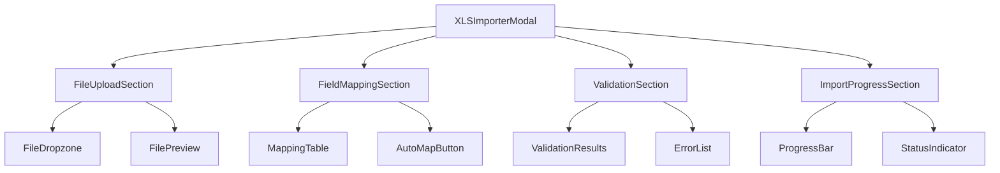
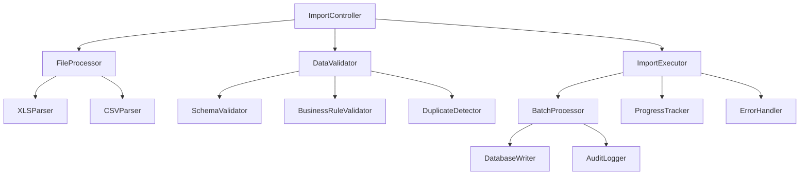
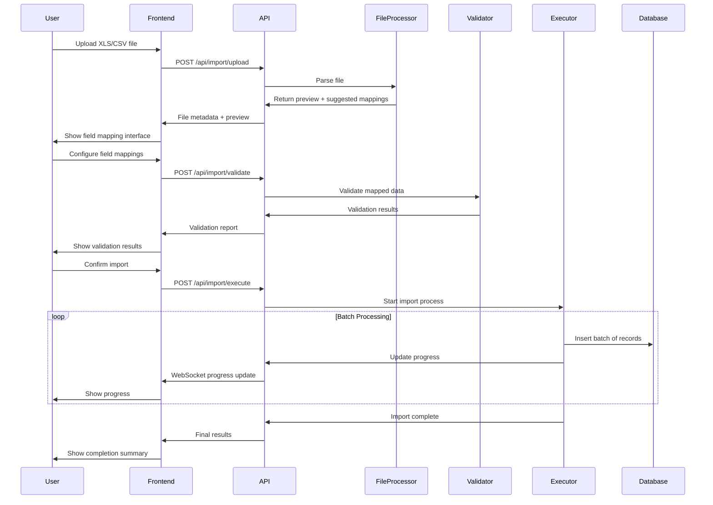

# XLS Importer Design for CRM System

## Overview

This design specifies an XLS/CSV importer for the CRM system to import opportunity data from external sources. The importer will process files in the format found in `novo_relatrio_12-09-2025.csv` and map the data to the current CRM opportunity schema.

### Business Context
- **Problem**: Manual data entry from external reports is time-consuming and error-prone
- **Solution**: Automated import system supporting XLS/CSV files with field mapping
- **Value**: Reduce data entry time by 90% and eliminate human errors in data import

### Key Requirements
- Support XLS and CSV file formats
- Field mapping between external format and CRM schema
- Data validation and error reporting
- Progress tracking for large imports
- Duplicate detection and handling
- Rollback capability for failed imports

## Technology Stack & Dependencies

### Backend Dependencies
- **XLSX**: Already available (v0.18.5) for Excel file processing
- **Multer**: File upload handling
- **Zod**: Data validation using existing schemas
- **Drizzle ORM**: Database operations with existing opportunities table

### Frontend Dependencies
- **React Hook Form**: Form handling for import configuration
- **React Query**: State management for import operations
- **Lucide React**: Icons for UI components
- **Radix UI**: Base components following existing patterns

## Component Architecture

### Core Components Hierarchy



### Component Definitions

#### XLSImporterModal
**Purpose**: Main container component for the import workflow
**Props**:
- `open: boolean` - Modal visibility state
- `onOpenChange: (open: boolean) => void` - Handle modal state changes

**State Management**:
- Import progress tracking
- Field mapping configuration
- Validation results
- File processing status

#### FileUploadSection
**Purpose**: Handles file selection and preview
**Features**:
- Drag & drop file upload
- File format validation (.xls, .xlsx, .csv)
- File size limits (max 50MB)
- Preview of first 5 rows

#### FieldMappingSection
**Purpose**: Maps external file columns to CRM fields
**Features**:
- Auto-mapping based on column headers
- Manual field selection via dropdowns
- Required field validation
- Custom field transformations

#### ValidationSection
**Purpose**: Shows validation results before import
**Features**:
- Data type validation
- Required field checks
- Duplicate detection
- Business rule validation

## Data Models & Field Mapping

### Source CSV Structure
The importer supports the CSV format with 61 columns including:

**Core Opportunity Fields**:
- Código (ID)
- Título (Title/Contact)
- Fase atual (Current Phase)
- Etiquetas (Tags/Temperature)
- Contato (Contact Name)
- CPF (Individual Tax ID)
- Empresa (Company)
- CNPJ (Company Tax ID)
- Telefone (Phone)

**Business Fields**:
- Origem de Oportunidade (Opportunity Origin)
- Temperatura do negócio (Business Temperature)
- Categoria de Necessidade (Need Category)
- Necessidades do Cliente (Client Needs)
- Vendedor responsável (Responsible Salesperson)

**Financial Fields**:
- Valor final da oportunidade (Final Opportunity Value)
- Nº de Orçamento (Budget Number)
- Descontos (Discounts)
- Descritivo de descontos (Discount Description)

### Field Mapping Configuration

```typescript
interface FieldMapping {
  sourceColumn: string;
  targetField: keyof Opportunity;
  transform?: (value: any) => any;
  required: boolean;
  validation?: (value: any) => boolean;
}

const defaultMappings: FieldMapping[] = [
  {
    sourceColumn: "Código",
    targetField: "id",
    transform: (value) => value?.toString(),
    required: false
  },
  {
    sourceColumn: "Título",
    targetField: "contact",
    required: true,
    validation: (value) => value?.length > 0
  },
  {
    sourceColumn: "Empresa",
    targetField: "company",
    required: true,
    validation: (value) => value?.length > 0
  },
  {
    sourceColumn: "Telefone",
    targetField: "phone",
    required: true,
    validation: (value) => /^\+?[\d\s\-\(\)]+$/.test(value)
  },
  {
    sourceColumn: "Fase atual",
    targetField: "phase",
    transform: (value) => mapPhaseValue(value),
    required: true
  },
  {
    sourceColumn: "Temperatura do negócio",
    targetField: "businessTemperature",
    transform: (value) => mapTemperatureValue(value),
    required: false
  }
];
```

### Data Transformation Functions

```typescript
function mapPhaseValue(value: string): PhaseType {
  const phaseMap: Record<string, PhaseType> = {
    "Prospecção": "prospeccao",
    "Em Atendimento": "em-atendimento",
    "Visita Técnica": "visita-tecnica",
    "Proposta": "proposta",
    "Negociação": "negociacao",
    "Ganho": "ganho",
    "Perdido": "perdido"
  };
  return phaseMap[value] || "prospeccao";
}

function mapTemperatureValue(value: string): string | null {
  const tempMap: Record<string, string> = {
    "Quente": "quente",
    "Morno": "morno",
    "Frio": "frio"
  };
  return tempMap[value] || null;
}
```

## API Endpoints Reference

### File Upload & Processing

#### POST /api/import/upload
**Purpose**: Upload and validate import file
**Authentication**: Required (Admin/Manager only)
**Request**:
```typescript
Content-Type: multipart/form-data
File: XLS/CSV file (max 50MB)
```

**Response**:
```typescript
{
  fileId: string;
  fileName: string;
  fileSize: number;
  rowCount: number;
  columns: string[];
  preview: Record<string, any>[];
  suggestedMappings: FieldMapping[];
}
```

#### POST /api/import/validate
**Purpose**: Validate mapped data before import
**Request**:
```typescript
{
  fileId: string;
  mappings: FieldMapping[];
  options: {
    skipDuplicates: boolean;
    updateExisting: boolean;
  }
}
```

**Response**:
```typescript
{
  validRecords: number;
  invalidRecords: number;
  duplicates: number;
  errors: ValidationError[];
  warnings: ValidationWarning[];
}
```

#### POST /api/import/execute
**Purpose**: Execute the import process
**Request**:
```typescript
{
  fileId: string;
  mappings: FieldMapping[];
  options: {
    skipDuplicates: boolean;
    updateExisting: boolean;
    batchSize: number;
  }
}
```

**Response**:
```typescript
{
  importId: string;
  status: 'started' | 'processing' | 'completed' | 'failed';
  processedRecords: number;
  totalRecords: number;
  errors: ImportError[];
}
```

### Import Progress Tracking

#### GET /api/import/status/:importId
**Purpose**: Get real-time import progress
**Response**:
```typescript
{
  importId: string;
  status: 'processing' | 'completed' | 'failed';
  progress: {
    processed: number;
    total: number;
    percentage: number;
  };
  results: {
    created: number;
    updated: number;
    skipped: number;
    errors: number;
  };
  errors: ImportError[];
}
```

## Business Logic Layer

### Import Service Architecture



### Core Services

#### FileProcessor
**Responsibilities**:
- Parse XLS/CSV files
- Extract column headers
- Generate data preview
- Suggest field mappings

**Key Methods**:
```typescript
class FileProcessor {
  async parseFile(file: Buffer, type: 'xlsx' | 'csv'): Promise<ParsedFile>;
  async generatePreview(data: any[]): Promise<PreviewData>;
  suggestMappings(columns: string[]): FieldMapping[];
}
```

#### DataValidator
**Responsibilities**:
- Validate data types
- Check required fields
- Apply business rules
- Detect duplicates

**Validation Rules**:
- Phone number format validation
- Email format validation
- CPF/CNPJ validation for Brazilian tax IDs
- Date format standardization
- Monetary value parsing

#### ImportExecutor
**Responsibilities**:
- Batch processing for large files
- Progress tracking
- Error handling and recovery
- Audit trail creation

**Processing Strategy**:
- Process in batches of 100 records
- Use database transactions for data integrity
- Implement retry logic for temporary failures
- Create detailed audit logs

## Data Flow Architecture

### Import Workflow



### Error Handling Strategy

#### Validation Errors
- **Field Format Errors**: Invalid phone numbers, emails, dates
- **Required Field Errors**: Missing critical information
- **Business Rule Errors**: Invalid phase transitions, duplicate records

#### Processing Errors
- **Database Errors**: Connection timeouts, constraint violations
- **System Errors**: Memory limits, file corruption
- **Network Errors**: Connection interruptions

#### Recovery Mechanisms
- **Automatic Retry**: For temporary failures (max 3 attempts)
- **Partial Rollback**: Undo incomplete batches
- **Error Reporting**: Detailed logs for manual correction
- **Resume Capability**: Continue from last successful batch

## User Interface Design

### Import Modal Layout

```
┌─────────────────────────────────────────────────────────┐
│ Import Opportunities from XLS/CSV              [X]     │
├─────────────────────────────────────────────────────────┤
│                                                         │
│ Step 1: Upload File                                     │
│ ┌─────────────────────────────────────────────────────┐ │
│ │  Drag & drop XLS/CSV file here or click to browse  │ │
│ │                                                     │ │
│ │  📄 Selected: report.xlsx (2.3 MB, 1,234 rows)     │ │
│ └─────────────────────────────────────────────────────┘ │
│                                                         │
│ Step 2: Map Fields                                      │
│ ┌─────────────────────────────────────────────────────┐ │
│ │ Source Column     →  CRM Field        Required      │ │
│ │ ───────────────────────────────────────────────────│ │
│ │ Código           →  [Not Mapped ▼]   ☐             │ │
│ │ Título           →  [Contact Name ▼] ☑             │ │
│ │ Empresa          →  [Company ▼]      ☑             │ │
│ │ Telefone         →  [Phone ▼]        ☑             │ │
│ │ ...                                                 │ │
│ └─────────────────────────────────────────────────────┘ │
│                                                         │
│ Step 3: Validation Results                              │
│ ┌─────────────────────────────────────────────────────┐ │
│ │ ✅ 1,150 valid records                              │ │
│ │ ⚠️  84 warnings (missing optional fields)           │ │
│ │ ❌ 0 errors                                         │ │
│ └─────────────────────────────────────────────────────┘ │
│                                                         │
│ Import Options:                                         │
│ ☑ Skip duplicate records                               │
│ ☐ Update existing records                              │
│ ☐ Create audit log                                     │
│                                                         │
│ [Cancel]  [Validate]  [Import] ←── Progress: 75%      │
└─────────────────────────────────────────────────────────┘
```

### Progress Tracking Interface

```
┌─────────────────────────────────────────────────────────┐
│ Import Progress                                  [X]    │
├─────────────────────────────────────────────────────────┤
│                                                         │
│ Processing: report.xlsx                                 │
│                                                         │
│ ████████████████████░░░ 75% Complete                   │
│                                                         │
│ Status: Processing batch 8 of 12                       │
│ Records processed: 750 / 1,000                         │
│                                                         │
│ Results so far:                                         │
│ • Created: 720 opportunities                           │
│ • Updated: 15 opportunities                            │
│ • Skipped: 10 duplicates                               │
│ • Errors: 5 validation failures                        │
│                                                         │
│ [Cancel Import]                    [View Error Log]    │
└─────────────────────────────────────────────────────────┘
```

## Testing Strategy

### Unit Testing

#### File Processing Tests
```typescript
describe('FileProcessor', () => {
  test('should parse CSV with semicolon delimiter', () => {
    const csvData = 'Código;Título;Empresa\n1179372104;CLODOALDO;TEST COMPANY';
    const result = FileProcessor.parseCSV(csvData);
    expect(result.rows).toHaveLength(1);
    expect(result.columns).toEqual(['Código', 'Título', 'Empresa']);
  });

  test('should handle XLS files correctly', () => {
    const xlsBuffer = fs.readFileSync('test-file.xlsx');
    const result = FileProcessor.parseXLS(xlsBuffer);
    expect(result.rows.length).toBeGreaterThan(0);
  });
});
```

#### Validation Tests
```typescript
describe('DataValidator', () => {
  test('should validate phone number formats', () => {
    expect(DataValidator.validatePhone('+55 92 99480-1573')).toBe(true);
    expect(DataValidator.validatePhone('invalid')).toBe(false);
  });

  test('should detect duplicate records', () => {
    const records = [
      { contact: 'João Silva', company: 'ABC Corp', phone: '123456789' },
      { contact: 'João Silva', company: 'ABC Corp', phone: '123456789' }
    ];
    const duplicates = DataValidator.findDuplicates(records);
    expect(duplicates).toHaveLength(1);
  });
});
```

### Integration Testing

#### Import Workflow Tests
```typescript
describe('Import Workflow', () => {
  test('should complete full import process', async () => {
    const file = createTestFile();
    const uploadResponse = await request(app)
      .post('/api/import/upload')
      .attach('file', file)
      .expect(200);
    
    const mappings = createTestMappings();
    const validateResponse = await request(app)
      .post('/api/import/validate')
      .send({ fileId: uploadResponse.body.fileId, mappings })
      .expect(200);
    
    const importResponse = await request(app)
      .post('/api/import/execute')
      .send({ fileId: uploadResponse.body.fileId, mappings })
      .expect(200);
    
    expect(importResponse.body.status).toBe('started');
  });
});
```

### End-to-End Testing

#### User Journey Tests
```typescript
describe('Import User Journey', () => {
  test('should allow user to import XLS file', async () => {
    await page.goto('/crm-dashboard');
    await page.click('[data-testid="import-button"]');
    
    // Upload file
    await page.setInputFiles('[data-testid="file-input"]', 'test-data.xlsx');
    await page.waitForText('File uploaded successfully');
    
    // Configure mappings
    await page.selectOption('[data-testid="mapping-contact"]', 'Título');
    await page.selectOption('[data-testid="mapping-company"]', 'Empresa');
    
    // Start import
    await page.click('[data-testid="start-import"]');
    await page.waitForText('Import completed');
    
    // Verify results
    const opportunities = await page.locator('[data-testid="opportunity-card"]');
    expect(await opportunities.count()).toBeGreaterThan(0);
  });
});
```