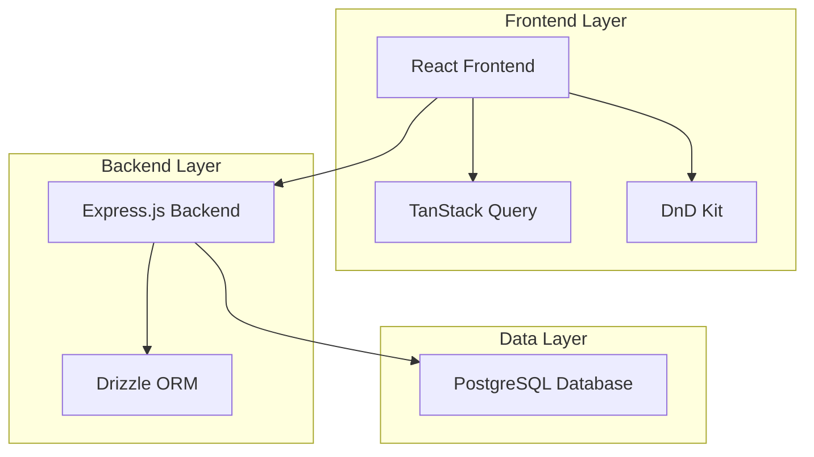
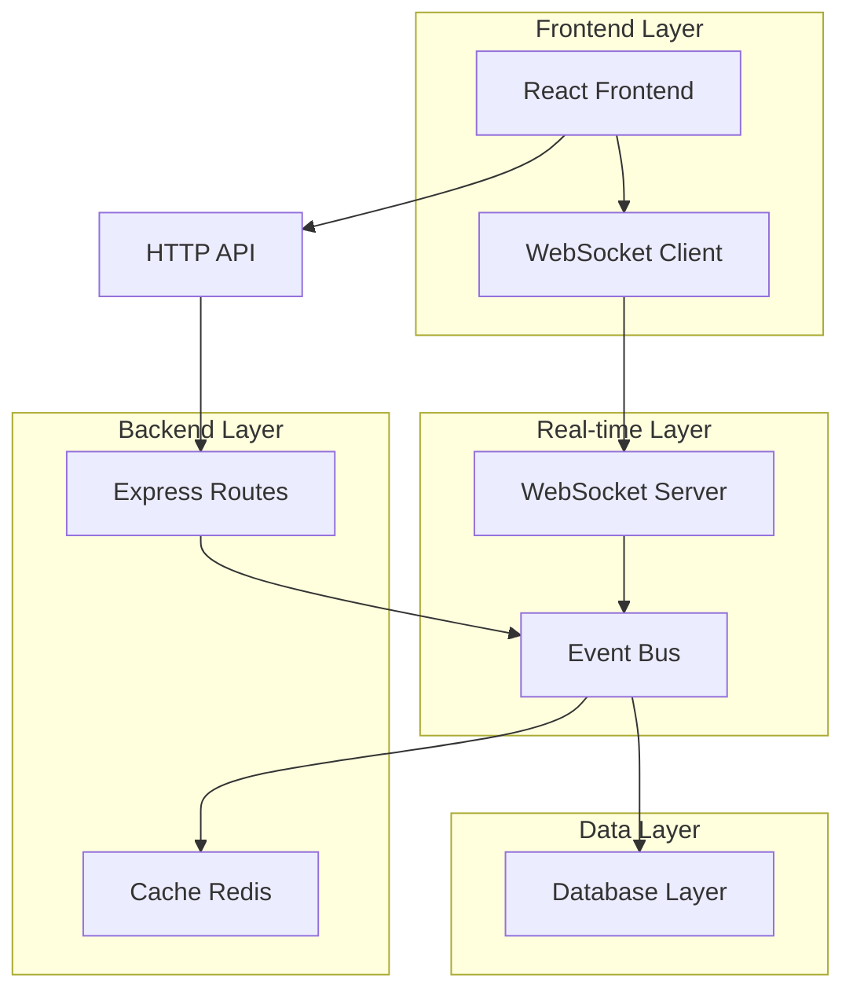
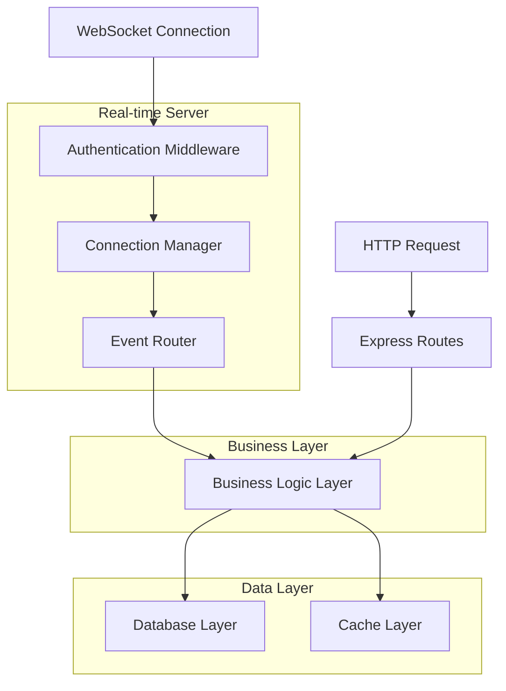

# Arquitetura Técnica - Atualizações Automáticas nos Quadros Kanban

## 1. Análise da Arquitetura Atual

### 1.1 Stack Tecnológico Existente


### 1.2 Componentes Kanban Identificados
- **CRM Dashboard** (`crm-dashboard.tsx`): Componente principal com DnD Context
- **Sales Pipeline Column** (`sales-pipeline-column.tsx`): Colunas do Kanban com drag & drop
- **Opportunity Card** (`opportunity-card.tsx`): Cards individuais com dados das oportunidades
- **API Routes** (`routes.ts`): Endpoints REST para CRUD de oportunidades

### 1.3 Limitações Atuais
- Atualizações apenas via refresh manual ou polling
- Sem sincronização em tempo real entre usuários
- Possibilidade de conflitos de dados em edições simultâneas
- Cache local limitado do TanStack Query

## 2. Arquitetura Proposta para Tempo Real



## 3. Descrição da Tecnologia

### 3.1 Stack Atualizado
- **Frontend**: React@18 + TypeScript + TailwindCSS@3 + Vite
- **Real-time**: WebSocket (ws@8.18.0) + Server-Sent Events fallback
- **Backend**: Express@4 + TypeScript + Redis para cache
- **Database**: PostgreSQL (via Drizzle ORM)
- **State Management**: Zustand para estado real-time + TanStack Query para cache

### 3.2 Novas Dependências
```json
{
  "ws": "^8.18.0",
  "redis": "^4.6.0",
  "zustand": "^4.4.0",
  "reconnecting-websocket": "^4.4.0"
}
```

## 4. Definições de API em Tempo Real

### 4.1 WebSocket Events

**Conexão e Autenticação**
```typescript
// Client -> Server
interface WSAuthMessage {
  type: 'auth';
  token: string;
  userId: string;
}

// Server -> Client
interface WSAuthResponse {
  type: 'auth_success' | 'auth_error';
  message?: string;
}
```

**Eventos de Oportunidade**
```typescript
// Mudança de oportunidade
interface OpportunityUpdateEvent {
  type: 'opportunity_updated';
  opportunityId: string;
  changes: Partial<Opportunity>;
  userId: string;
  timestamp: string;
}

// Movimentação no pipeline
interface OpportunityMoveEvent {
  type: 'opportunity_moved';
  opportunityId: string;
  fromPhase: string;
  toPhase: string;
  userId: string;
  timestamp: string;
}

// Nova oportunidade
interface OpportunityCreatedEvent {
  type: 'opportunity_created';
  opportunity: Opportunity;
  userId: string;
  timestamp: string;
}

// Oportunidade excluída
interface OpportunityDeletedEvent {
  type: 'opportunity_deleted';
  opportunityId: string;
  userId: string;
  timestamp: string;
}
```

**Eventos de Presença**
```typescript
// Usuário editando
interface UserEditingEvent {
  type: 'user_editing';
  opportunityId: string;
  userId: string;
  userName: string;
  timestamp: string;
}

// Usuário parou de editar
interface UserStoppedEditingEvent {
  type: 'user_stopped_editing';
  opportunityId: string;
  userId: string;
  timestamp: string;
}
```

### 4.2 REST API Enhancements

**Endpoint de Sincronização**
```
GET /api/sync/opportunities?since=timestamp
```

Response:
```typescript
interface SyncResponse {
  opportunities: Opportunity[];
  deletedIds: string[];
  lastSync: string;
  hasMore: boolean;
}
```

**Endpoint de Conflito**
```
POST /api/opportunities/:id/resolve-conflict
```

Request:
```typescript
interface ConflictResolution {
  clientVersion: string;
  serverVersion: string;
  resolution: 'client' | 'server' | 'merge';
  mergedData?: Partial<Opportunity>;
}
```

## 5. Arquitetura do Servidor Real-time



### 5.1 Componentes do Servidor

**Connection Manager**
```typescript
class ConnectionManager {
  private connections = new Map<string, WebSocket>();
  private userSessions = new Map<string, Set<string>>();
  
  addConnection(userId: string, ws: WebSocket): void;
  removeConnection(userId: string, connectionId: string): void;
  broadcastToUsers(userIds: string[], event: WSEvent): void;
  broadcastToAll(event: WSEvent): void;
}
```

**Event Router**
```typescript
class EventRouter {
  private handlers = new Map<string, EventHandler>();
  
  register(eventType: string, handler: EventHandler): void;
  route(event: WSEvent, connection: Connection): Promise<void>;
}
```

**Conflict Resolver**
```typescript
class ConflictResolver {
  resolveOpportunityConflict(
    clientData: Opportunity,
    serverData: Opportunity,
    strategy: 'last-write-wins' | 'merge'
  ): Opportunity;
}
```

## 6. Modelo de Dados Atualizado

### 6.1 Extensões do Schema

```sql
-- Tabela para tracking de versões
CREATE TABLE opportunity_versions (
    id UUID PRIMARY KEY DEFAULT gen_random_uuid(),
    opportunity_id VARCHAR REFERENCES opportunities(id),
    version_number INTEGER NOT NULL,
    data JSONB NOT NULL,
    created_by VARCHAR REFERENCES users(id),
    created_at TIMESTAMP WITH TIME ZONE DEFAULT NOW()
);

-- Tabela para presença de usuários
CREATE TABLE user_presence (
    id UUID PRIMARY KEY DEFAULT gen_random_uuid(),
    user_id VARCHAR REFERENCES users(id),
    opportunity_id VARCHAR REFERENCES opportunities(id),
    action VARCHAR NOT NULL, -- 'editing', 'viewing'
    started_at TIMESTAMP WITH TIME ZONE DEFAULT NOW(),
    last_activity TIMESTAMP WITH TIME ZONE DEFAULT NOW()
);

-- Índices para performance
CREATE INDEX idx_opportunity_versions_opportunity_id ON opportunity_versions(opportunity_id);
CREATE INDEX idx_opportunity_versions_created_at ON opportunity_versions(created_at DESC);
CREATE INDEX idx_user_presence_opportunity_id ON user_presence(opportunity_id);
CREATE INDEX idx_user_presence_user_id ON user_presence(user_id);

-- Adicionar campos de versionamento à tabela principal
ALTER TABLE opportunities 
ADD COLUMN version_number INTEGER DEFAULT 1,
ADD COLUMN last_modified_by VARCHAR REFERENCES users(id),
ADD COLUMN last_sync_at TIMESTAMP WITH TIME ZONE DEFAULT NOW();
```

### 6.2 Triggers para Versionamento

```sql
-- Trigger para criar versão a cada update
CREATE OR REPLACE FUNCTION create_opportunity_version()
RETURNS TRIGGER AS $$
BEGIN
    -- Incrementar versão
    NEW.version_number = OLD.version_number + 1;
    NEW.last_sync_at = NOW();
    
    -- Salvar versão anterior
    INSERT INTO opportunity_versions (opportunity_id, version_number, data, created_by)
    VALUES (
        OLD.id,
        OLD.version_number,
        to_jsonb(OLD),
        NEW.last_modified_by
    );
    
    RETURN NEW;
END;
$$ LANGUAGE plpgsql;

CREATE TRIGGER trigger_opportunity_versioning
    BEFORE UPDATE ON opportunities
    FOR EACH ROW
    EXECUTE FUNCTION create_opportunity_version();
```

## 7. Implementação Frontend

### 7.1 WebSocket Hook

```typescript
// hooks/useWebSocket.ts
export function useWebSocket() {
  const [isConnected, setIsConnected] = useState(false);
  const [lastMessage, setLastMessage] = useState<WSEvent | null>(null);
  const wsRef = useRef<ReconnectingWebSocket | null>(null);
  
  const connect = useCallback(() => {
    const ws = new ReconnectingWebSocket('ws://localhost:5000/ws');
    
    ws.onopen = () => setIsConnected(true);
    ws.onclose = () => setIsConnected(false);
    ws.onmessage = (event) => {
      const message = JSON.parse(event.data);
      setLastMessage(message);
    };
    
    wsRef.current = ws;
  }, []);
  
  const sendMessage = useCallback((message: WSEvent) => {
    if (wsRef.current?.readyState === WebSocket.OPEN) {
      wsRef.current.send(JSON.stringify(message));
    }
  }, []);
  
  return { isConnected, lastMessage, connect, sendMessage };
}
```

### 7.2 Real-time Store

```typescript
// stores/realtimeStore.ts
interface RealtimeState {
  opportunities: Map<string, Opportunity>;
  editingUsers: Map<string, string[]>; // opportunityId -> userIds
  pendingChanges: Map<string, Partial<Opportunity>>;
  
  updateOpportunity: (id: string, changes: Partial<Opportunity>) => void;
  setUserEditing: (opportunityId: string, userId: string) => void;
  removeUserEditing: (opportunityId: string, userId: string) => void;
}

export const useRealtimeStore = create<RealtimeState>((set, get) => ({
  opportunities: new Map(),
  editingUsers: new Map(),
  pendingChanges: new Map(),
  
  updateOpportunity: (id, changes) => {
    set((state) => {
      const newOpportunities = new Map(state.opportunities);
      const existing = newOpportunities.get(id);
      if (existing) {
        newOpportunities.set(id, { ...existing, ...changes });
      }
      return { opportunities: newOpportunities };
    });
  },
  
  // ... outras ações
}));
```

### 7.3 Componente Atualizado

```typescript
// components/OpportunityCard.tsx (atualizado)
export default function OpportunityCard({ opportunity }: Props) {
  const { sendMessage } = useWebSocket();
  const { editingUsers } = useRealtimeStore();
  const [isEditing, setIsEditing] = useState(false);
  
  const currentEditingUsers = editingUsers.get(opportunity.id) || [];
  const isBeingEdited = currentEditingUsers.length > 0;
  
  const handleStartEditing = () => {
    setIsEditing(true);
    sendMessage({
      type: 'user_editing',
      opportunityId: opportunity.id,
      userId: user.id,
      userName: user.name,
      timestamp: new Date().toISOString()
    });
  };
  
  return (
    <div className={`opportunity-card ${
      isBeingEdited ? 'border-yellow-400 shadow-yellow-100' : ''
    }`}>
      {isBeingEdited && (
        <div className="text-xs text-yellow-600 mb-2">
          👥 {currentEditingUsers.length} usuário(s) editando
        </div>
      )}
      {/* resto do componente */}
    </div>
  );
}
```

## 8. Estratégias de Otimização

### 8.1 Debouncing e Batching

```typescript
// utils/eventBatcher.ts
class EventBatcher {
  private batch: WSEvent[] = [];
  private timeout: NodeJS.Timeout | null = null;
  
  add(event: WSEvent) {
    this.batch.push(event);
    
    if (this.timeout) clearTimeout(this.timeout);
    
    this.timeout = setTimeout(() => {
      this.flush();
    }, 100); // 100ms debounce
  }
  
  private flush() {
    if (this.batch.length > 0) {
      this.sendBatch(this.batch);
      this.batch = [];
    }
  }
}
```

### 8.2 Cache Inteligente

```typescript
// services/cacheService.ts
class CacheService {
  private cache = new Map<string, CacheEntry>();
  
  set(key: string, data: any, ttl: number = 300000) { // 5min default
    this.cache.set(key, {
      data,
      expires: Date.now() + ttl,
      version: this.getVersion(key)
    });
  }
  
  get(key: string): any | null {
    const entry = this.cache.get(key);
    if (!entry || entry.expires < Date.now()) {
      this.cache.delete(key);
      return null;
    }
    return entry.data;
  }
  
  invalidate(pattern: string) {
    for (const [key] of this.cache) {
      if (key.includes(pattern)) {
        this.cache.delete(key);
      }
    }
  }
}
```

## 9. Plano de Implementação

### 9.1 Fase 1: Infraestrutura Base (2 semanas)
- Configurar WebSocket server
- Implementar sistema de autenticação WS
- Criar connection manager básico
- Testes de conectividade

### 9.2 Fase 2: Eventos Básicos (2 semanas)
- Implementar eventos de CRUD de oportunidades
- Sincronização básica entre clientes
- Sistema de versionamento
- Testes de sincronização

### 9.3 Fase 3: Recursos Avançados (3 semanas)
- Sistema de presença de usuários
- Resolução de conflitos
- Cache inteligente
- Otimizações de performance

### 9.4 Fase 4: Polimento e Deploy (1 semana)
- Testes de carga
- Monitoramento e métricas
- Deploy gradual
- Documentação

## 10. Considerações de Performance e Escalabilidade

### 10.1 Métricas de Performance
- **Latência**: < 100ms para propagação de eventos
- **Throughput**: 1000 eventos/segundo por instância
- **Conexões simultâneas**: 50-100 por instância
- **Uso de memória**: < 512MB por instância

### 10.2 Estratégias de Escalabilidade
- **Horizontal scaling**: Load balancer com sticky sessions
- **Redis pub/sub**: Para comunicação entre instâncias
- **Database connection pooling**: Otimizar conexões DB
- **CDN**: Para assets estáticos

### 10.3 Monitoramento
```typescript
// metrics/wsMetrics.ts
class WSMetrics {
  private connections = 0;
  private messagesPerSecond = 0;
  private latencyHistogram: number[] = [];
  
  recordConnection() { this.connections++; }
  recordDisconnection() { this.connections--; }
  recordMessage(latency: number) {
    this.messagesPerSecond++;
    this.latencyHistogram.push(latency);
  }
  
  getMetrics() {
    return {
      activeConnections: this.connections,
      messagesPerSecond: this.messagesPerSecond,
      avgLatency: this.calculateAvgLatency(),
      p95Latency: this.calculateP95Latency()
    };
  }
}
```

## 11. Impacto nos Usuários e Migração

### 11.1 Benefícios para Usuários
- **Colaboração melhorada**: Visibilidade em tempo real das ações de outros usuários
- **Redução de conflitos**: Menos erros por dados desatualizados
- **Produtividade aumentada**: Menos tempo perdido com refreshs manuais
- **Experiência fluida**: Interface sempre atualizada

### 11.2 Estratégia de Migração
1. **Deploy paralelo**: Sistema antigo e novo rodando simultaneamente
2. **Feature flag**: Ativar gradualmente para grupos de usuários
3. **Fallback automático**: Retorno ao sistema antigo em caso de problemas
4. **Treinamento**: Documentação e tutoriais para novos recursos

### 11.3 Plano de Rollback
- Desativar WebSocket via feature flag
- Retornar ao polling tradicional
- Manter compatibilidade com APIs REST existentes
- Monitoramento contínuo de métricas de erro