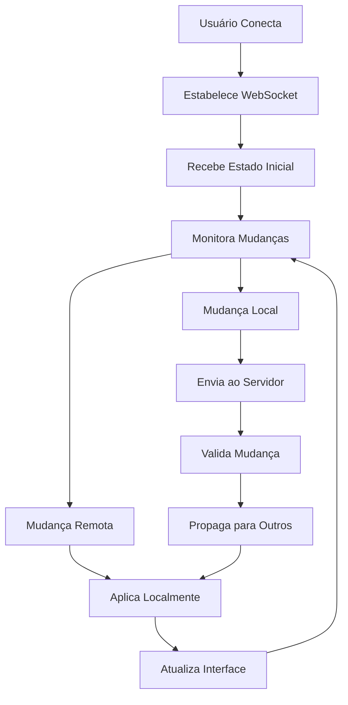

# Atualizações Automáticas nos Quadros Kanban - Documento de Requisitos do Produto

## 1. Visão Geral do Produto
Implementação de sistema de atualizações automáticas em tempo real para os quadros Kanban do CRM, permitindo sincronização instantânea de mudanças entre múltiplos usuários simultâneos. O sistema atual utiliza atualizações manuais via refresh, criando inconsistências quando múltiplos usuários trabalham simultaneamente.

- O objetivo é eliminar conflitos de dados e garantir que todos os usuários vejam as mudanças em tempo real, melhorando a colaboração e a eficiência operacional.
- Esta funcionalidade aumentará significativamente a produtividade da equipe e reduzirá erros causados por informações desatualizadas.

## 2. Funcionalidades Principais

### 2.1 Papéis de Usuário
| Papel | Método de Registro | Permissões Principais |
|-------|-------------------|----------------------|
| Usuário | Registro por email | Recebe atualizações em tempo real de suas oportunidades e pode ver mudanças de outros usuários |
| Gerente | Convite/promoção | Recebe todas as atualizações em tempo real do sistema, incluindo mudanças de qualquer usuário |
| Admin | Acesso administrativo | Controle total sobre configurações de sincronização e monitoramento de performance |

### 2.2 Módulos de Funcionalidade
Nossas funcionalidades de atualização automática consistem nos seguintes componentes principais:
1. **Sistema de Sincronização**: WebSocket/Server-Sent Events para comunicação em tempo real.
2. **Cache Inteligente**: Sistema de cache local com invalidação automática.
3. **Resolução de Conflitos**: Algoritmos para resolver conflitos de edição simultânea.
4. **Monitoramento**: Dashboard para acompanhar performance e status das conexões.

### 2.3 Detalhes das Páginas

| Nome da Página | Nome do Módulo | Descrição da Funcionalidade |
|----------------|----------------|-----------------------------||
| Dashboard CRM | Sistema de Sincronização | Receber e aplicar atualizações em tempo real de cards movidos, editados ou criados por outros usuários |
| Dashboard CRM | Indicadores Visuais | Mostrar indicadores de "usuário editando" e "mudanças pendentes" para melhor awareness |
| Dashboard CRM | Cache Local | Manter cache local dos dados com sincronização automática e fallback para dados do servidor |
| Modal de Detalhes | Edição Colaborativa | Detectar e resolver conflitos quando múltiplos usuários editam a mesma oportunidade |
| Pipeline Kanban | Movimentação em Tempo Real | Sincronizar movimentações de cards entre colunas instantaneamente para todos os usuários |

## 3. Processo Principal

### Fluxo de Sincronização em Tempo Real
1. Usuário conecta ao dashboard CRM
2. Sistema estabelece conexão WebSocket/SSE
3. Mudanças locais são enviadas imediatamente ao servidor
4. Servidor valida e propaga mudanças para outros usuários conectados
5. Clientes recebem e aplicam atualizações automaticamente
6. Sistema resolve conflitos quando necessário

### Fluxo de Resolução de Conflitos
1. Sistema detecta edição simultânea
2. Aplica estratégia de resolução (last-write-wins ou merge)
3. Notifica usuários sobre conflitos resolvidos
4. Mantém histórico de mudanças para auditoria

## 4. Design da Interface do Usuário

### 4.1 Estilo de Design
- **Cores primárias e secundárias**: Manter paleta existente com adição de indicadores de status (azul #3B82F6 para sincronizado, amarelo #F59E0B para pendente, verde #10B981 para sucesso)
- **Estilo de botões**: Botões existentes com indicadores de loading e status de sincronização
- **Fonte e tamanhos**: Manter Inter font com adição de badges pequenos (10px) para status
- **Estilo de layout**: Layout atual com overlay sutil para indicar mudanças em tempo real
- **Ícones**: Lucide React icons para status (Wifi, WifiOff, Loader2, CheckCircle)

### 4.2 Visão Geral do Design das Páginas

| Nome da Página | Nome do Módulo | Elementos da UI |
|----------------|----------------|----------------|
| Dashboard CRM | Indicadores de Status | Badge de conexão no header, indicadores de "editando" em cards, animações suaves para mudanças |
| Dashboard CRM | Notificações | Toast notifications discretas para mudanças importantes, sem interromper o fluxo |
| Modal de Detalhes | Edição Colaborativa | Indicador de "outro usuário editando", campos com highlight para mudanças, botão de refresh manual |
| Pipeline Kanban | Animações | Transições suaves para cards movidos remotamente, feedback visual para ações locais vs remotas |

### 4.3 Responsividade
O sistema mantém funcionalidade completa em dispositivos móveis, com indicadores de status adaptados para telas menores e otimizações de bateria para conexões móveis.

## 5. Requisitos Técnicos

### 5.1 Performance
- Latência máxima de 100ms para propagação de mudanças
- Suporte para até 50 usuários simultâneos por instância
- Fallback automático para polling se WebSocket falhar
- Compressão de dados para reduzir bandwidth

### 5.2 Confiabilidade
- Reconexão automática em caso de perda de conexão
- Queue local para mudanças durante desconexão
- Sincronização completa ao reconectar
- Backup de dados local para recuperação

### 5.3 Segurança
- Autenticação de conexões WebSocket
- Validação de permissões para cada mudança
- Rate limiting para prevenir spam
- Logs de auditoria para todas as mudanças