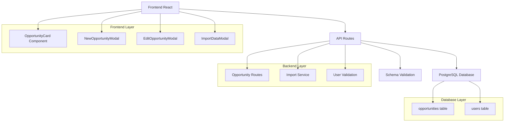
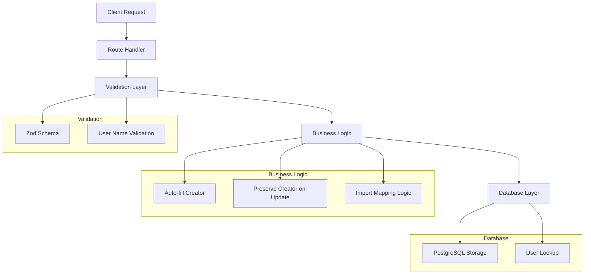
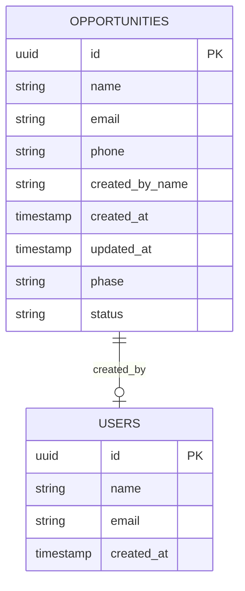

# Campo "Criado por" nos Cards - Arquitetura Técnica

## 1. Arquitetura do Sistema



## 2. Descrição das Tecnologias

* **Frontend**: React\@18 + TypeScript + Tailwind CSS

* **Backend**: Express.js + TypeScript

* **Database**: PostgreSQL (via Supabase)

* **Validation**: Zod schemas

* **State Management**: React hooks + Context

## 3. Definições de Rotas

| Rota                           | Propósito                                                  |
| ------------------------------ | ---------------------------------------------------------- |
| GET /api/opportunities         | Buscar oportunidades (incluindo created\_by\_name)         |
| POST /api/opportunities        | Criar nova oportunidade (auto-preencher created\_by\_name) |
| PUT /api/opportunities/:id     | Atualizar oportunidade (preservar created\_by\_name)       |
| POST /api/import/opportunities | Importar oportunidades com mapeamento de criador           |
| GET /api/users/names           | Buscar nomes de usuários para validação na importação      |

## 4. Definições da API

### 4.1 Core API

**Criar Nova Oportunidade**

```
POST /api/opportunities
```

Request:

| Nome do Parâmetro | Tipo   | Obrigatório | Descrição                                          |
| ----------------- | ------ | ----------- | -------------------------------------------------- |
| name              | string | true        | Nome da oportunidade                               |
| email             | string | true        | Email do cliente                                   |
| phone             | string | false       | Telefone do cliente                                |
| created\_by\_name | string | false       | Nome do criador (auto-preenchido se não fornecido) |

Response:

| Nome do Parâmetro | Tipo   | Descrição                 |
| ----------------- | ------ | ------------------------- |
| id                | string | ID da oportunidade criada |
| created\_by\_name | string | Nome do usuário que criou |

**Importar Oportunidades**

```
POST /api/import/opportunities
```

Request:

| Nome do Parâmetro | Tipo   | Obrigatório | Descrição                                         |
| ----------------- | ------ | ----------- | ------------------------------------------------- |
| data              | array  | true        | Array de oportunidades                            |
| mapping           | object | true        | Mapeamento de colunas incluindo created\_by\_name |

Response:

| Nome do Parâmetro | Tipo   | Descrição                      |
| ----------------- | ------ | ------------------------------ |
| imported          | number | Número de registros importados |
| errors            | array  | Lista de erros de validação    |

## 5. Arquitetura do Servidor



## 6. Modelo de Dados

### 6.1 Definição do Modelo de Dados



### 6.2 Linguagem de Definição de Dados (DDL)

**Migração para adicionar campo created\_by\_name**

```sql
-- Adicionar coluna created_by_name à tabela opportunities
ALTER TABLE opportunities 
ADD COLUMN created_by_name VARCHAR(255);

-- Criar índice para melhor performance nas consultas
CREATE INDEX idx_opportunities_created_by_name 
ON opportunities(created_by_name);

-- Atualizar registros existentes com nome do usuário padrão
UPDATE opportunities 
SET created_by_name = 'Sistema' 
WHERE created_by_name IS NULL;

-- Tornar o campo obrigatório após preencher dados existentes
ALTER TABLE opportunities 
ALTER COLUMN created_by_name SET NOT NULL;

-- Adicionar constraint para garantir que o nome não seja vazio
ALTER TABLE opportunities 
ADD CONSTRAINT check_created_by_name_not_empty 
CHECK (length(trim(created_by_name)) > 0);
```

**Schema de Validação (Zod)**

```typescript
// Schema para criação de oportunidade
const createOpportunitySchema = z.object({
  name: z.string().min(1, "Nome é obrigatório"),
  email: z.string().email("Email inválido"),
  phone: z.string().optional(),
  created_by_name: z.string().optional(), // Auto-preenchido se não fornecido
});

// Schema para importação
const importOpportunitySchema = z.object({
  name: z.string().min(1),
  email: z.string().email(),
  phone: z.string().optional(),
  created_by_name: z.string().min(1, "Criador é obrigatório na importação"),
});

// Schema para atualização (preserva created_by_name)
const updateOpportunitySchema = z.object({
  name: z.string().min(1).optional(),
  email: z.string().email().optional(),
  phone: z.string().optional(),
  // created_by_name não incluído - não pode ser alterado
});
```

**Dados Iniciais**

```sql
-- Inserir usuários padrão se não existirem
INSERT INTO users (id, name, email, created_at) 
VALUES 
  (gen_random_uuid(), 'Sistema', 'sistema@crm.com', NOW()),
  (gen_random_uuid(), 'Administrador', 'admin@crm.com', NOW())
ON CONFLICT (email) DO NOTHING;

-- Exemplo de oportunidade com criador
INSERT INTO opportunities (
  id, name, email, phone, created_by_name, 
  phase, status, created_at, updated_at
) VALUES (
  gen_random_uuid(), 
  'Oportunidade Exemplo', 
  'cliente@exemplo.com', 
  '(11) 99999-9999',
  'Administrador',
  'lead',
  'active',
  NOW(),
  NOW()
);
```

