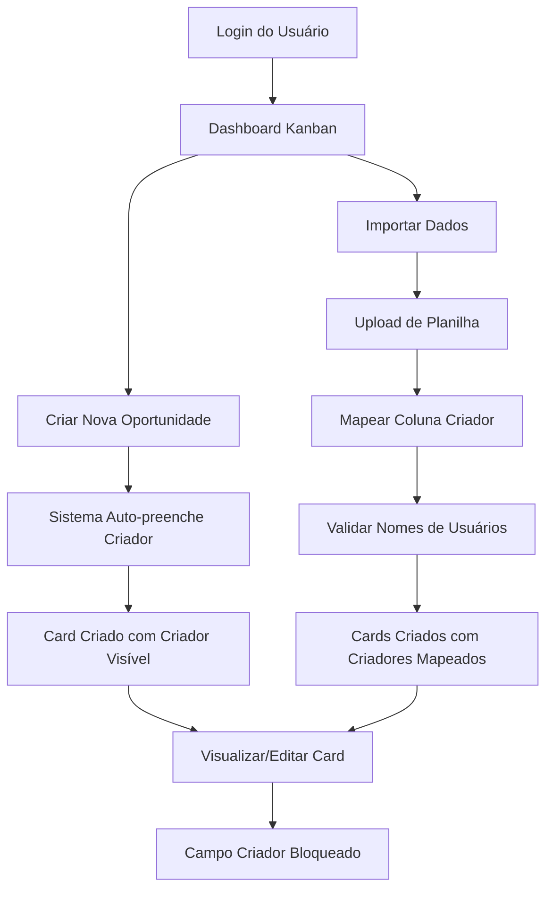

# Campo "Criado por" nos Cards do Kanban - PRD

## 1. Visão Geral do Produto

Sistema de rastreabilidade de criação de cards no CRM Kanban, permitindo identificar quem criou cada oportunidade e possibilitando o mapeamento deste campo durante importações de dados. O campo será visível mas não editável, garantindo a integridade da informação de auditoria.

## 2. Funcionalidades Principais

### 2.1 Papéis de Usuário
| Papel | Método de Registro | Permissões Principais |
|-------|-------------------|----------------------|
| Usuário Padrão | Login existente | Pode criar cards (automaticamente registrado como criador), visualizar criador de todos os cards |
| Administrador | Login existente | Todas as permissões do usuário padrão + pode importar dados mapeando criadores |

### 2.2 Módulos de Funcionalidade

Nossos requisitos consistem nas seguintes páginas principais:
1. **Cards do Kanban**: exibição do campo "Criado por", informação não editável
2. **Formulário de Nova Oportunidade**: preenchimento automático do criador atual
3. **Formulário de Edição**: campo "Criado por" visível mas bloqueado
4. **Sistema de Importação**: opção de mapeamento da coluna "Criado por"

### 2.3 Detalhes das Páginas

| Nome da Página | Nome do Módulo | Descrição da Funcionalidade |
|----------------|----------------|----------------------------|
| Cards do Kanban | Exibição do Criador | Mostrar nome do criador de forma discreta mas visível no card. Usar ícone de usuário + nome. |
| Nova Oportunidade | Auto-preenchimento | Automaticamente definir o usuário logado como criador. Campo não visível no formulário (preenchido nos bastidores). |
| Edição de Oportunidade | Campo Bloqueado | Exibir campo "Criado por" como readonly com ícone de cadeado. Não permitir edição. |
| Importação de Dados | Mapeamento de Coluna | Adicionar opção "Criado por" na lista de campos mapeáveis. Validar se o nome existe no sistema. |
| Detalhes da Oportunidade | Informação de Auditoria | Mostrar "Criado por" junto com data de criação na seção de informações do card. |

## 3. Fluxo Principal

### Fluxo do Usuário Padrão:
1. Usuário acessa o sistema e faz login
2. Cria nova oportunidade através do formulário
3. Sistema automaticamente registra o usuário como criador
4. Card aparece no Kanban com informação do criador visível
5. Ao editar, usuário vê o campo "Criado por" mas não pode alterá-lo

### Fluxo de Importação:
1. Administrador acessa sistema de importação
2. Faz upload da planilha com dados
3. No mapeamento de colunas, seleciona qual coluna contém o criador
4. Sistema valida se os nomes existem no sistema
5. Cards são criados com os criadores mapeados da planilha

## 4. Design da Interface

### 4.1 Estilo de Design
- **Cores**: Usar cor secundária (#6B7280) para o texto do criador
- **Ícones**: Ícone de usuário (👤) antes do nome do criador
- **Fonte**: Texto menor (text-sm) para não competir com informações principais
- **Layout**: Posicionar na parte inferior do card, alinhado à esquerda
- **Estado Bloqueado**: Ícone de cadeado (🔒) + fundo cinza claro para campos readonly

### 4.2 Visão Geral do Design das Páginas

| Nome da Página | Nome do Módulo | Elementos da UI |
|----------------|----------------|-----------------|
| Cards do Kanban | Indicador de Criador | Ícone de usuário + nome em texto pequeno, cor secundária, posicionado no rodapé do card |
| Nova Oportunidade | Campo Oculto | Não visível no formulário - preenchimento automático nos bastidores |
| Edição de Oportunidade | Campo Readonly | Input com fundo cinza claro, ícone de cadeado, texto não selecionável, label "Criado por" |
| Importação de Dados | Seletor de Mapeamento | Dropdown com opção "Criado por" na lista de campos disponíveis para mapeamento |
| Modal de Detalhes | Seção de Auditoria | Seção dedicada com "Criado por: [Nome]" e "Data de criação: [Data]" em formato de lista |

### 4.3 Responsividade
O campo "Criado por" deve ser adaptativo:
- **Desktop**: Texto completo com ícone
- **Mobile**: Apenas iniciais do nome + ícone para economizar espaço
- **Tablet**: Nome abreviado (primeiro nome + sobrenome) + ícone