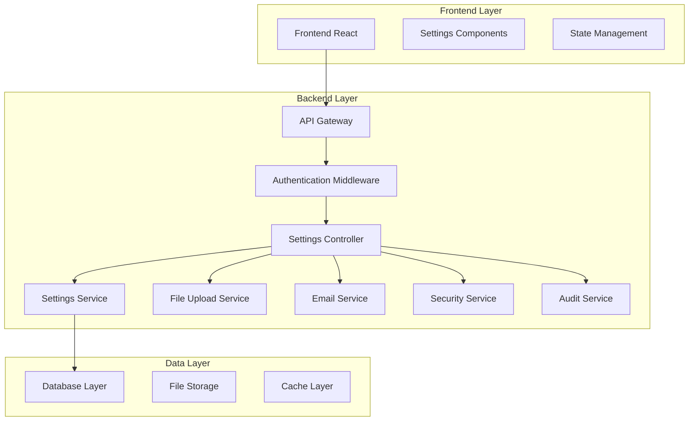
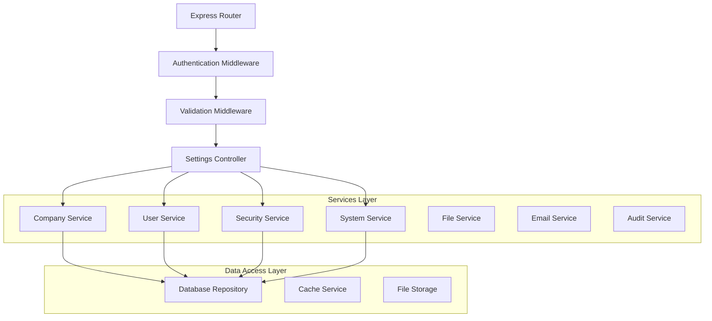
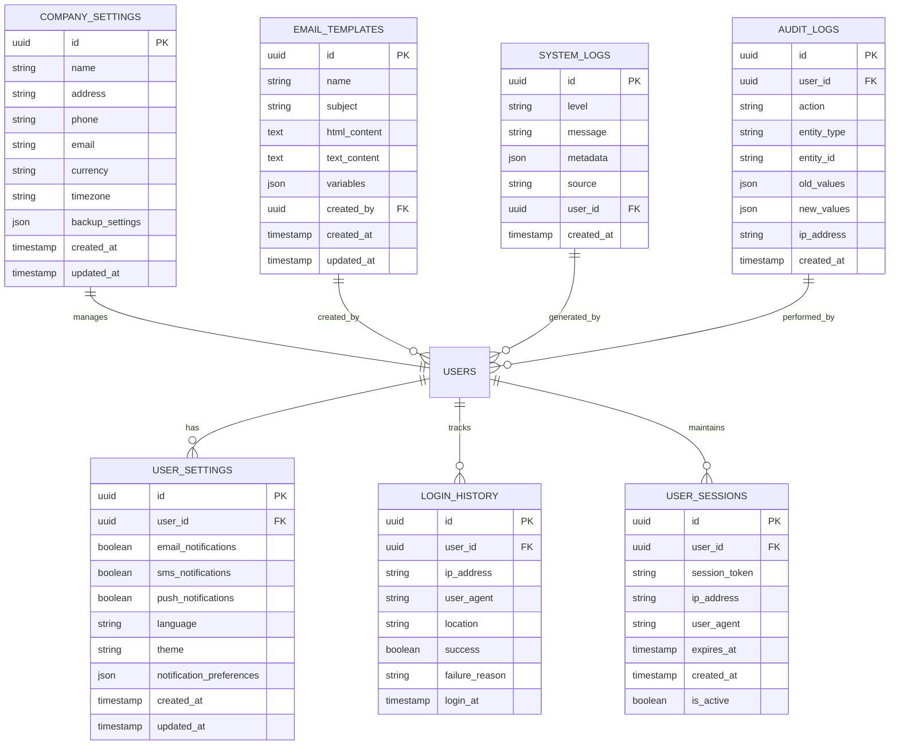

# Arquitetura Técnica - Sistema de Configurações Completo

## 1. Arquitetura do Sistema



## 2. Descrição das Tecnologias

- **Frontend**: React@18 + TypeScript + TailwindCSS + Vite
- **Backend**: Express@4 + TypeScript
- **Database**: Supabase (PostgreSQL)
- **File Storage**: Base64 encoding para compatibilidade
- **Authentication**: Express Session + bcrypt
- **Validation**: Zod para validação de schemas

## 3. Definições de Rotas

| Rota | Propósito |
|------|-----------|
| /settings | Página principal de configurações |
| /settings/profile | Configurações de perfil do usuário |
| /settings/security | Configurações de segurança |
| /settings/notifications | Configurações de notificações |
| /settings/system | Configurações do sistema (admin) |

## 4. Definições de API

### 4.1 APIs Principais

**Configurações da Empresa**
```
PUT /api/company/settings
```

Request:
| Parâmetro | Tipo | Obrigatório | Descrição |
|-----------|------|-------------|-----------|
| name | string | true | Nome da empresa |
| address | string | false | Endereço completo |
| phone | string | false | Telefone principal |
| email | string | false | Email corporativo |
| currency | string | false | Moeda padrão (BRL, USD, EUR) |
| timezone | string | false | Fuso horário |

Response:
| Parâmetro | Tipo | Descrição |
|-----------|------|-----------|
| success | boolean | Status da operação |
| data | object | Configurações atualizadas |

**Upload de Foto de Perfil**
```
POST /api/user/profile/photo
```

Request:
| Parâmetro | Tipo | Obrigatório | Descrição |
|-----------|------|-------------|-----------|
| photo | file | true | Arquivo de imagem (JPG, PNG, max 5MB) |

Response:
| Parâmetro | Tipo | Descrição |
|-----------|------|-----------|
| success | boolean | Status do upload |
| photoUrl | string | URL da foto salva |

**Configurações de Segurança**
```
PUT /api/user/security
```

Request:
| Parâmetro | Tipo | Obrigatório | Descrição |
|-----------|------|-------------|-----------|
| twoFactorEnabled | boolean | false | Ativar/desativar 2FA |
| passwordExpiry | number | false | Dias para expiração da senha |
| sessionTimeout | number | false | Timeout da sessão em minutos |

**Histórico de Login**
```
GET /api/user/login-history
```

Query Parameters:
| Parâmetro | Tipo | Descrição |
|-----------|------|-----------|
| page | number | Página para paginação |
| limit | number | Itens por página |
| startDate | string | Data inicial (ISO) |
| endDate | string | Data final (ISO) |

**Templates de Email**
```
GET /api/email/templates
POST /api/email/templates
PUT /api/email/templates/:id
DELETE /api/email/templates/:id
```

**Logs do Sistema**
```
GET /api/system/logs
```

Query Parameters:
| Parâmetro | Tipo | Descrição |
|-----------|------|-----------|
| level | string | Nível do log (info, warn, error) |
| startDate | string | Data inicial |
| endDate | string | Data final |
| search | string | Busca por texto |

**Métricas de Performance**
```
GET /api/system/metrics
```

Response:
| Parâmetro | Tipo | Descrição |
|-----------|------|-----------|
| cpuUsage | number | Uso de CPU (%) |
| memoryUsage | number | Uso de memória (%) |
| activeUsers | number | Usuários ativos |
| responseTime | number | Tempo médio de resposta (ms) |

**Importação de Dados**
```
POST /api/import/data
```

Request:
| Parâmetro | Tipo | Obrigatório | Descrição |
|-----------|------|-------------|-----------|
| file | file | true | Arquivo CSV/Excel |
| mapping | object | true | Mapeamento de colunas |
| options | object | false | Opções de importação |

## 5. Arquitetura do Servidor



## 6. Modelo de Dados

### 6.1 Definição do Modelo de Dados



### 6.2 Linguagem de Definição de Dados (DDL)

**Tabela de Configurações da Empresa**
```sql
-- Criar tabela de configurações da empresa
CREATE TABLE company_settings (
    id UUID PRIMARY KEY DEFAULT gen_random_uuid(),
    name VARCHAR(255) NOT NULL,
    address TEXT,
    phone VARCHAR(50),
    email VARCHAR(255),
    currency VARCHAR(10) DEFAULT 'BRL',
    timezone VARCHAR(100) DEFAULT 'America/Sao_Paulo',
    backup_settings JSONB DEFAULT '{"enabled": true, "frequency": "daily", "time": "02:00"}',
    created_at TIMESTAMP WITH TIME ZONE DEFAULT NOW(),
    updated_at TIMESTAMP WITH TIME ZONE DEFAULT NOW()
);

-- Criar tabela de configurações do usuário
CREATE TABLE user_settings (
    id UUID PRIMARY KEY DEFAULT gen_random_uuid(),
    user_id UUID NOT NULL REFERENCES users(id) ON DELETE CASCADE,
    email_notifications BOOLEAN DEFAULT true,
    sms_notifications BOOLEAN DEFAULT false,
    push_notifications BOOLEAN DEFAULT false,
    language VARCHAR(10) DEFAULT 'pt-BR',
    theme VARCHAR(20) DEFAULT 'light',
    notification_preferences JSONB DEFAULT '{}',
    created_at TIMESTAMP WITH TIME ZONE DEFAULT NOW(),
    updated_at TIMESTAMP WITH TIME ZONE DEFAULT NOW(),
    UNIQUE(user_id)
);

-- Criar tabela de histórico de login
CREATE TABLE login_history (
    id UUID PRIMARY KEY DEFAULT gen_random_uuid(),
    user_id UUID NOT NULL REFERENCES users(id) ON DELETE CASCADE,
    ip_address INET,
    user_agent TEXT,
    location VARCHAR(255),
    success BOOLEAN NOT NULL,
    failure_reason VARCHAR(255),
    login_at TIMESTAMP WITH TIME ZONE DEFAULT NOW()
);

-- Criar tabela de sessões ativas
CREATE TABLE user_sessions (
    id UUID PRIMARY KEY DEFAULT gen_random_uuid(),
    user_id UUID NOT NULL REFERENCES users(id) ON DELETE CASCADE,
    session_token VARCHAR(255) NOT NULL UNIQUE,
    ip_address INET,
    user_agent TEXT,
    expires_at TIMESTAMP WITH TIME ZONE NOT NULL,
    created_at TIMESTAMP WITH TIME ZONE DEFAULT NOW(),
    is_active BOOLEAN DEFAULT true
);

-- Criar tabela de templates de email
CREATE TABLE email_templates (
    id UUID PRIMARY KEY DEFAULT gen_random_uuid(),
    name VARCHAR(255) NOT NULL,
    subject VARCHAR(500) NOT NULL,
    html_content TEXT NOT NULL,
    text_content TEXT,
    variables JSONB DEFAULT '[]',
    created_by UUID NOT NULL REFERENCES users(id),
    created_at TIMESTAMP WITH TIME ZONE DEFAULT NOW(),
    updated_at TIMESTAMP WITH TIME ZONE DEFAULT NOW()
);

-- Criar tabela de logs do sistema
CREATE TABLE system_logs (
    id UUID PRIMARY KEY DEFAULT gen_random_uuid(),
    level VARCHAR(20) NOT NULL CHECK (level IN ('info', 'warn', 'error', 'debug')),
    message TEXT NOT NULL,
    metadata JSONB DEFAULT '{}',
    source VARCHAR(100),
    user_id UUID REFERENCES users(id),
    created_at TIMESTAMP WITH TIME ZONE DEFAULT NOW()
);

-- Criar tabela de logs de auditoria
CREATE TABLE audit_logs (
    id UUID PRIMARY KEY DEFAULT gen_random_uuid(),
    user_id UUID NOT NULL REFERENCES users(id),
    action VARCHAR(50) NOT NULL,
    entity_type VARCHAR(50) NOT NULL,
    entity_id VARCHAR(255) NOT NULL,
    old_values JSONB,
    new_values JSONB,
    ip_address INET,
    created_at TIMESTAMP WITH TIME ZONE DEFAULT NOW()
);

-- Criar índices para performance
CREATE INDEX idx_login_history_user_id ON login_history(user_id);
CREATE INDEX idx_login_history_login_at ON login_history(login_at DESC);
CREATE INDEX idx_user_sessions_user_id ON user_sessions(user_id);
CREATE INDEX idx_user_sessions_expires_at ON user_sessions(expires_at);
CREATE INDEX idx_system_logs_level ON system_logs(level);
CREATE INDEX idx_system_logs_created_at ON system_logs(created_at DESC);
CREATE INDEX idx_audit_logs_user_id ON audit_logs(user_id);
CREATE INDEX idx_audit_logs_created_at ON audit_logs(created_at DESC);

-- Inserir configurações padrão da empresa
INSERT INTO company_settings (name, currency, timezone) 
VALUES ('Minha Empresa CRM', 'BRL', 'America/Sao_Paulo');

-- Configurar permissões Supabase
GRANT SELECT, INSERT, UPDATE, DELETE ON company_settings TO authenticated;
GRANT SELECT, INSERT, UPDATE, DELETE ON user_settings TO authenticated;
GRANT SELECT, INSERT ON login_history TO authenticated;
GRANT SELECT, INSERT, UPDATE, DELETE ON user_sessions TO authenticated;
GRANT SELECT, INSERT, UPDATE, DELETE ON email_templates TO authenticated;
GRANT SELECT, INSERT ON system_logs TO authenticated;
GRANT SELECT, INSERT ON audit_logs TO authenticated;

-- Permissões básicas para usuários anônimos (apenas leitura limitada)
GRANT SELECT ON company_settings TO anon;
```