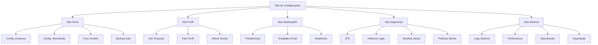

# Sistema de Configurações Completo - CRM

## 1. Visão Geral do Produto

Sistema completo de configurações para o CRM que permite aos usuários personalizar todos os aspectos da aplicação, desde configurações pessoais até configurações administrativas do sistema. O objetivo é transformar todos os elementos não funcionais da tela de configurações em funcionalidades completas e úteis.

## 2. Funcionalidades Principais

### 2.1 Papéis de Usuário

| Papel | Método de Registro | Permissões Principais |
|-------|-------------------|----------------------|
| Usuário | Criado por Admin/Gerente | Configurações pessoais, notificações, perfil |
| Gerente | Criado por Admin | Todas as do usuário + configurações de equipe |
| Admin | Acesso direto | Todas as configurações incluindo sistema e segurança |

### 2.2 Módulos de Funcionalidades

O sistema de configurações consiste nas seguintes páginas principais:

1. **Aba Geral**: configurações da empresa, moeda, fuso horário, backup automático
2. **Aba Perfil**: informações pessoais, foto de perfil, alteração de senha
3. **Aba Notificações**: preferências de notificação, templates de email, webhooks
4. **Aba Segurança**: autenticação de dois fatores, histórico de login, sessões ativas
5. **Aba Sistema**: logs do sistema, performance, manutenção do banco de dados

### 2.3 Detalhes das Páginas

| Página | Módulo | Descrição da Funcionalidade |
|--------|--------|----------------------------|
| Aba Geral | Configurações da Empresa | Gerenciar nome da empresa, endereço, telefone, email corporativo |
| Aba Geral | Configurações Monetárias | Definir moeda padrão, formato de números, símbolos monetários |
| Aba Geral | Fuso Horário | Configurar fuso horário padrão do sistema |
| Aba Geral | Backup Automático | Configurar frequência e horário dos backups automáticos |
| Aba Perfil | Informações Pessoais | Editar nome, email, telefone, cargo, biografia |
| Aba Perfil | Foto de Perfil | Upload e gerenciamento da foto do usuário |
| Aba Perfil | Alteração de Senha | Alterar senha com validação de segurança |
| Aba Notificações | Preferências | Configurar notificações por email, SMS, push |
| Aba Notificações | Templates de Email | Criar e editar templates personalizados |
| Aba Notificações | Webhooks | Configurar integrações com sistemas externos |
| Aba Segurança | Autenticação 2FA | Ativar/desativar autenticação de dois fatores |
| Aba Segurança | Histórico de Login | Visualizar tentativas de login e atividades |
| Aba Segurança | Sessões Ativas | Gerenciar sessões ativas e fazer logout remoto |
| Aba Segurança | Políticas de Senha | Configurar regras de complexidade de senha |
| Aba Sistema | Logs do Sistema | Visualizar e filtrar logs de atividades |
| Aba Sistema | Performance | Monitorar métricas de performance do sistema |
| Aba Sistema | Manutenção | Executar tarefas de manutenção do banco de dados |
| Aba Sistema | Importação de Dados | Importar dados de sistemas externos (CSV, Excel) |

## 3. Fluxo Principal de Processos

### Fluxo do Usuário Regular
1. Acessa configurações → Edita perfil pessoal → Configura notificações → Salva alterações

### Fluxo do Administrador
1. Acessa configurações → Configura empresa → Define políticas de segurança → Configura backups → Monitora sistema

## 4. Design da Interface do Usuário

### 4.1 Estilo de Design

- **Cores Primárias**: #3B82F6 (azul), #10B981 (verde para sucesso)
- **Cores Secundárias**: #6B7280 (cinza), #EF4444 (vermelho para alertas)
- **Estilo dos Botões**: Arredondados com sombra sutil
- **Fonte**: Inter, tamanhos 14px (corpo), 16px (títulos), 12px (labels)
- **Layout**: Cards organizados em abas com navegação horizontal
- **Ícones**: Lucide React com estilo outline

### 4.2 Visão Geral do Design das Páginas

| Página | Módulo | Elementos da UI |
|--------|--------|-----------------|
| Aba Geral | Configurações Empresa | Card com inputs para nome, endereço, telefone, email. Botão "Salvar Configurações" |
| Aba Geral | Configurações Monetárias | Select para moeda, input para símbolo, radio buttons para formato |
| Aba Perfil | Upload Foto | Área de drag-and-drop com preview da imagem, botão "Alterar Foto" |
| Aba Perfil | Alteração Senha | Inputs com validação em tempo real, indicador de força da senha |
| Aba Notificações | Templates Email | Lista de templates com botões "Editar" e "Duplicar", modal de edição |
| Aba Segurança | 2FA | Toggle switch com QR code para configuração, inputs para verificação |
| Aba Segurança | Histórico Login | Tabela com filtros por data, IP, status. Paginação |
| Aba Sistema | Logs | Tabela com filtros avançados, export para CSV, refresh automático |
| Aba Sistema | Performance | Gráficos de métricas em tempo real, alertas configuráveis |

### 4.3 Responsividade

- **Desktop-first** com adaptação para tablets e mobile
- **Breakpoints**: 1024px (desktop), 768px (tablet), 480px (mobile)
- **Touch optimization** para elementos interativos em dispositivos móveis
- **Navegação em abas** se transforma em accordion em telas pequenas