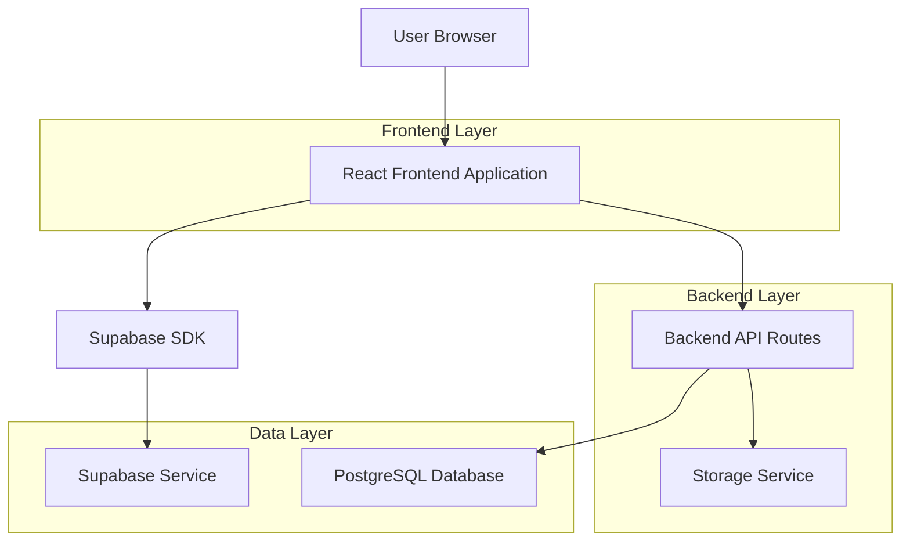
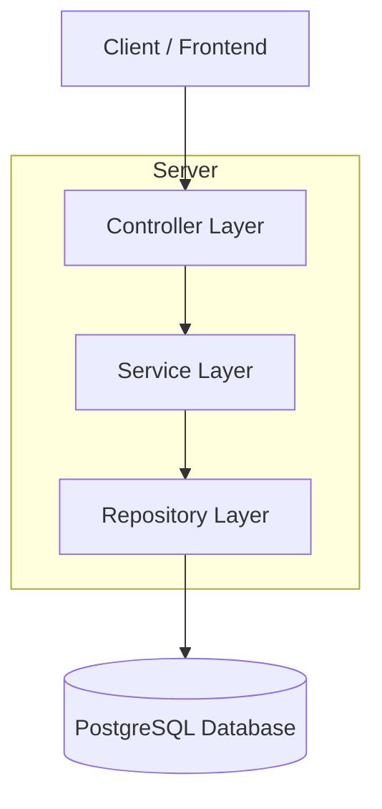
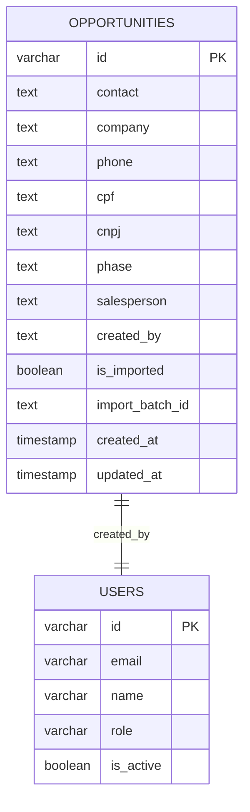

# Arquitetura Técnica - Funcionalidades para Cards Importados

## 1. Design da Arquitetura



## 2. Descrição da Tecnologia
- Frontend: React@18 + TypeScript + TailwindCSS@3 + Vite
- Backend: Express@4 + TypeScript
- Database: PostgreSQL (via Drizzle ORM)
- Autenticação: Session-based authentication
- UI Components: Shadcn/ui + Lucide React icons

## 3. Definições de Rotas

| Rota | Propósito |
|------|----------|
| /dashboard | Dashboard principal do CRM com cards importados e manuais |
| /api/opportunities/:id | API para edição de oportunidades (importadas e manuais) |
| /api/opportunities/:id/delete | API para exclusão de oportunidades (importadas e manuais) |
| /api/opportunities/:id/move/:phase | API para movimentação entre fases |

## 4. Definições de API

### 4.1 APIs Principais

**Edição de Oportunidade Importada**
```
PATCH /api/opportunities/:id
```

Request:
| Nome do Parâmetro | Tipo do Parâmetro | Obrigatório | Descrição |
|-------------------|-------------------|-------------|----------|
| id | string | true | ID da oportunidade |
| contact | string | false | Nome do contato |
| company | string | false | Nome da empresa |
| phone | string | false | Telefone |
| phase | string | false | Fase atual |
| salesperson | string | false | Vendedor responsável |
| budget | string | false | Valor do orçamento |

Response:
| Nome do Parâmetro | Tipo do Parâmetro | Descrição |
|-------------------|-------------------|----------|
| success | boolean | Status da operação |
| opportunity | object | Dados atualizados da oportunidade |

Exemplo:
```json
{
  "contact": "João Silva",
  "company": "Empresa ABC",
  "phone": "11999999999",
  "budget": "50000.00"
}
```

**Exclusão de Oportunidade Importada**
```
DELETE /api/opportunities/:id
```

Request:
| Nome do Parâmetro | Tipo do Parâmetro | Obrigatório | Descrição |
|-------------------|-------------------|-------------|----------|
| id | string | true | ID da oportunidade a ser excluída |

Response:
| Nome do Parâmetro | Tipo do Parâmetro | Descrição |
|-------------------|-------------------|----------|
| success | boolean | Status da exclusão |
| message | string | Mensagem de confirmação |

## 5. Arquitetura do Servidor



## 6. Modelo de Dados

### 6.1 Definição do Modelo de Dados



### 6.2 Linguagem de Definição de Dados

**Modificação na Tabela de Oportunidades**
```sql
-- Adicionar campos para identificar origem dos cards
ALTER TABLE opportunities 
ADD COLUMN is_imported BOOLEAN DEFAULT FALSE,
ADD COLUMN import_batch_id TEXT NULL,
ADD COLUMN import_source TEXT NULL;

-- Criar índice para consultas de cards importados
CREATE INDEX idx_opportunities_is_imported ON opportunities(is_imported);
CREATE INDEX idx_opportunities_import_batch ON opportunities(import_batch_id);

-- Atualizar registros existentes importados (se houver forma de identificá-los)
-- Esta query deve ser executada após análise dos dados existentes
-- UPDATE opportunities SET is_imported = TRUE WHERE created_by = 'import_system';

-- Criar trigger para auditoria de alterações em cards importados
CREATE OR REPLACE FUNCTION audit_imported_opportunities()
RETURNS TRIGGER AS $$
BEGIN
    IF NEW.is_imported = TRUE THEN
        INSERT INTO audit_logs (user_id, action, entity, entity_id, changes, timestamp)
        VALUES (
            COALESCE(current_setting('app.current_user_id', true), 'system'),
            TG_OP,
            'opportunity',
            NEW.id,
            jsonb_build_object(
                'old', to_jsonb(OLD),
                'new', to_jsonb(NEW)
            ),
            NOW()
        );
    END IF;
    RETURN NEW;
END;
$$ LANGUAGE plpgsql;

CREATE TRIGGER trigger_audit_imported_opportunities
    AFTER UPDATE ON opportunities
    FOR EACH ROW
    EXECUTE FUNCTION audit_imported_opportunities();
```

**Permissões de Acesso**
```sql
-- Garantir que usuários autenticados possam modificar oportunidades
GRANT SELECT, INSERT, UPDATE, DELETE ON opportunities TO authenticated;

-- Permitir leitura básica para usuários anônimos (se necessário)
GRANT SELECT ON opportunities TO anon;

-- Criar política de segurança para cards importados
CREATE POLICY "Users can modify their own imported opportunities" ON opportunities
    FOR ALL USING (
        auth.uid()::text = created_by OR 
        auth.jwt() ->> 'role' IN ('admin', 'gerente')
    );
```

**Dados Iniciais**
```sql
-- Inserir configurações para cards importados
INSERT INTO user_settings (user_id, setting_key, setting_value)
VALUES 
    ('system', 'allow_imported_card_deletion', 'true'),
    ('system', 'allow_imported_card_editing', 'true'),
    ('system', 'imported_card_audit_enabled', 'true');

-- Criar template de email para notificações de cards importados
INSERT INTO email_templates (name, subject, body, trigger, active)
VALUES (
    'imported_opportunity_modified',
    'Oportunidade Importada Modificada',
    'A oportunidade {{opportunity.contact}} da empresa {{opportunity.company}} foi modificada.',
    'imported_opportunity_updated',
    true
);
```
