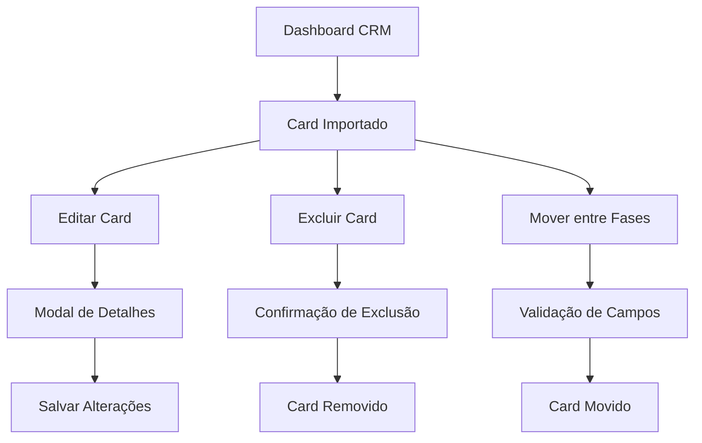

# Funcionalidades para Cards Importados - PRD

## 1. Visão Geral do Produto
Implementação de funcionalidades de exclusão e edição para cards de oportunidades importados no sistema CRM. Atualmente, o sistema permite apenas exclusão e edição de cards criados manualmente, mas não oferece essas opções para cards importados via planilha.

- O objetivo é equalizar as funcionalidades entre cards importados e cards criados manualmente, permitindo que usuários tenham controle total sobre todas as oportunidades no sistema.
- Esta funcionalidade aumentará a flexibilidade do sistema e melhorará a experiência do usuário ao gerenciar dados importados.

## 2. Funcionalidades Principais

### 2.1 Papéis de Usuário
| Papel | Método de Registro | Permissões Principais |
|-------|-------------------|----------------------|
| Usuário | Registro por email | Pode excluir e editar apenas suas próprias oportunidades (criadas ou importadas por ele) |
| Gerente | Convite/promoção | Pode excluir e editar qualquer oportunidade, incluindo importadas |
| Admin | Acesso administrativo | Controle total sobre todas as oportunidades do sistema |

### 2.2 Módulos de Funcionalidade
Nossas funcionalidades para cards importados consistem nas seguintes páginas principais:
1. **Dashboard CRM**: visualização de cards importados com opções de exclusão e edição.
2. **Modal de Detalhes**: edição completa de dados de cards importados.
3. **Pipeline de Vendas**: arrastar e soltar cards importados entre fases.

### 2.3 Detalhes das Páginas

| Nome da Página | Nome do Módulo | Descrição da Funcionalidade |
|----------------|----------------|-----------------------------|
| Dashboard CRM | Cards de Oportunidade | Exibir cards importados com botões de exclusão e edição. Aplicar mesmas regras de permissão dos cards manuais |
| Dashboard CRM | Coluna do Pipeline | Permitir arrastar cards importados entre fases. Validar campos obrigatórios antes da movimentação |
| Modal de Detalhes | Formulário de Edição | Habilitar edição completa de todos os campos de cards importados. Salvar alterações no banco de dados |
| Modal de Detalhes | Botão de Exclusão | Adicionar botão de exclusão para cards importados com confirmação de segurança |
| Modal de Detalhes | Validação de Dados | Aplicar mesmas validações de dados para cards importados e manuais |

## 3. Processo Principal

### Fluxo do Usuário Regular
1. Usuário acessa o Dashboard CRM
2. Visualiza cards importados (identificados por origem)
3. Pode editar cards importados que criou/importou
4. Pode excluir cards importados que criou/importou
5. Pode mover cards importados entre fases do pipeline

### Fluxo do Gerente/Admin
1. Acessa Dashboard CRM com permissões elevadas
2. Pode editar qualquer card importado
3. Pode excluir qualquer card importado
4. Pode gerenciar todos os cards independente da origem

## 4. Design da Interface do Usuário

### 4.1 Estilo de Design
- **Cores primárias e secundárias**: Manter paleta existente do sistema (azul #3B82F6, verde #10B981, vermelho #EF4444)
- **Estilo de botões**: Botões arredondados com hover effects, ícones Lucide React
- **Fonte e tamanhos**: Inter font, tamanhos 12px-16px para texto, 18px-24px para títulos
- **Estilo de layout**: Layout baseado em cards, navegação superior, sidebar responsiva
- **Ícones**: Lucide React icons, estilo outline, tamanho 16px-20px

### 4.2 Visão Geral do Design das Páginas

| Nome da Página | Nome do Módulo | Elementos da UI |
|----------------|----------------|----------------|
| Dashboard CRM | Card de Oportunidade | Badge "Importado" em cards importados, botões de ação com ícones, hover states consistentes |
| Modal de Detalhes | Formulário de Edição | Campos de input habilitados, botão "Salvar" destacado em azul, validação em tempo real |
| Modal de Detalhes | Botão de Exclusão | Botão vermelho com ícone de lixeira, modal de confirmação com fundo escuro |
| Pipeline | Colunas de Fase | Drag & drop visual feedback, indicadores de validação, animações suaves |

### 4.3 Responsividade
O sistema é desktop-first com adaptação mobile. Cards importados mantêm funcionalidades completas em dispositivos móveis, com botões de ação adaptados para touch interaction.
