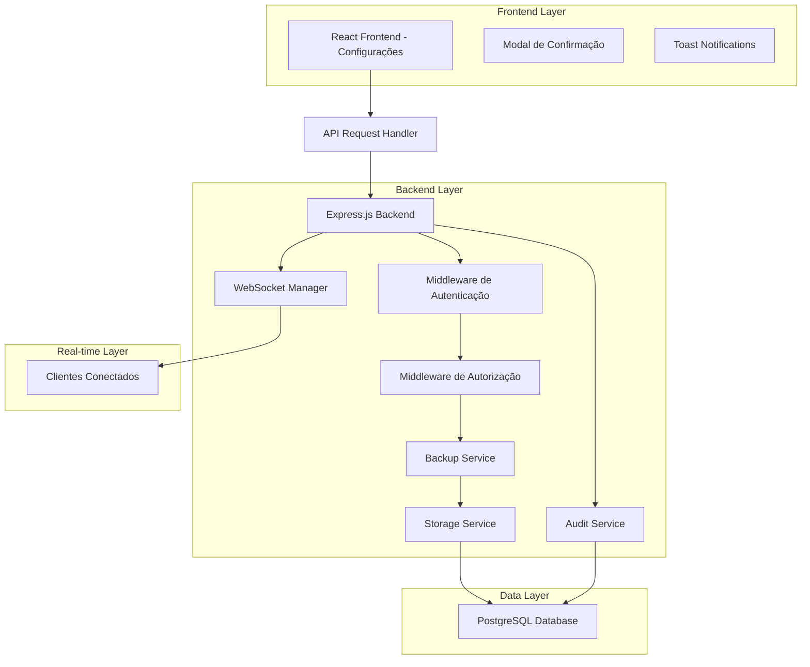
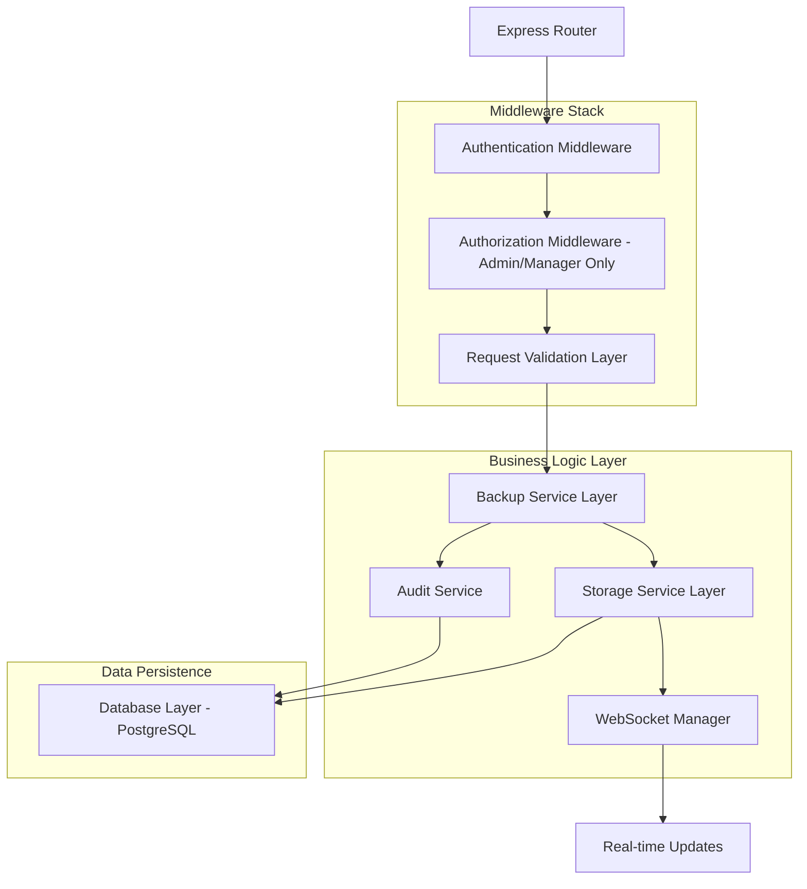
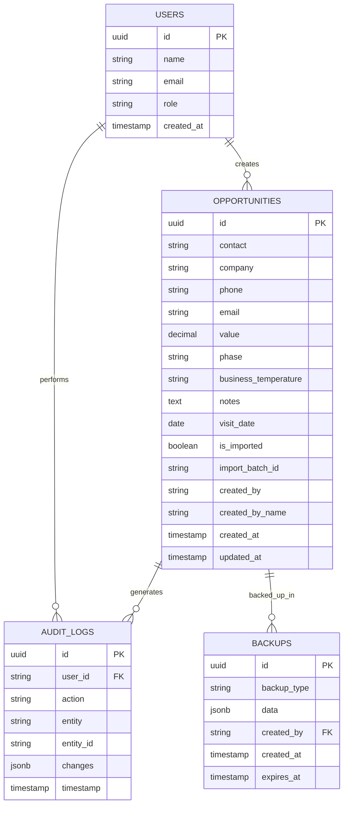

# Arquitetura Técnica: Funcionalidade "Limpar Todos os Cards"

## 1. Arquitetura do Sistema



## 2. Descrição das Tecnologias

- Frontend: React@18 + TypeScript + Tailwind CSS + Lucide React + Wouter + TanStack Query
- Backend: Express@4 + TypeScript + Express Session
- Database: PostgreSQL (via Supabase)
- Real-time: WebSocket + PostgreSQL LISTEN/NOTIFY
- UI Components: Shadcn/ui + Radix UI

## 3. Definições de Rotas

| Rota | Propósito |
|------|-----------|
| /settings | Página de configurações com aba Sistema contendo o botão de limpeza |
| /api/admin/clear-kanban-cards | Endpoint para limpar todos os cards do Kanban |
| /api/backup/create-cards-backup | Endpoint para criar backup das oportunidades |

## 4. Definições da API

### 4.1 API Principal

**Limpeza de Cards do Kanban**
```
DELETE /api/admin/clear-kanban-cards
```

Request Headers:
| Nome | Tipo | Obrigatório | Descrição |
|------|------|-------------|-----------|
| Cookie | string | true | Session cookie para autenticação |

Response:
| Nome | Tipo | Descrição |
|------|------|-----------|
| success | boolean | Status da operação |
| message | string | Mensagem de confirmação |
| summary | object | Resumo da operação |
| summary.cardsRemoved | number | Quantidade de cards removidos |
| summary.backupCreated | boolean | Se backup foi criado |
| summary.backupId | string | ID do backup criado |

Exemplo de Response:
```json
{
  "success": true,
  "message": "Todos os cards foram removidos com sucesso",
  "summary": {
    "cardsRemoved": 45,
    "backupCreated": true,
    "backupId": "backup_20241215_143022"
  }
}
```

**Verificação de Cards Existentes**
```
GET /api/admin/kanban-cards-count
```

Response:
| Nome | Tipo | Descrição |
|------|------|-----------|
| count | number | Quantidade total de cards no Kanban |
| hasCards | boolean | Se existem cards no sistema |

**Criação de Backup**
```
POST /api/backup/create-cards-backup
```

Response:
| Nome | Tipo | Descrição |
|------|------|-----------|
| success | boolean | Status da criação do backup |
| backupId | string | ID único do backup |
| expiresAt | string | Data de expiração do backup (24h) |

## 5. Arquitetura do Servidor



## 6. Modelo de Dados

### 6.1 Definição do Modelo de Dados



### 6.2 Linguagem de Definição de Dados (DDL)

**Tabela de Backups**
```sql
-- Criar tabela de backups se não existir
CREATE TABLE IF NOT EXISTS backups (
    id UUID PRIMARY KEY DEFAULT gen_random_uuid(),
    backup_type VARCHAR(50) NOT NULL,
    data JSONB NOT NULL,
    created_by UUID REFERENCES users(id),
    created_at TIMESTAMP WITH TIME ZONE DEFAULT NOW(),
    expires_at TIMESTAMP WITH TIME ZONE NOT NULL
);

-- Criar índices para performance
CREATE INDEX IF NOT EXISTS idx_backups_type ON backups(backup_type);
CREATE INDEX IF NOT EXISTS idx_backups_created_by ON backups(created_by);
CREATE INDEX IF NOT EXISTS idx_backups_expires_at ON backups(expires_at);

-- Trigger para limpeza automática de backups expirados
CREATE OR REPLACE FUNCTION cleanup_expired_backups()
RETURNS TRIGGER AS $$
BEGIN
    DELETE FROM backups WHERE expires_at < NOW();
    RETURN NULL;
END;
$$ LANGUAGE plpgsql;

-- Criar trigger que executa a cada inserção
DROP TRIGGER IF EXISTS trigger_cleanup_expired_backups ON backups;
CREATE TRIGGER trigger_cleanup_expired_backups
    AFTER INSERT ON backups
    EXECUTE FUNCTION cleanup_expired_backups();

-- Função para criar backup das oportunidades
CREATE OR REPLACE FUNCTION create_opportunities_backup(backup_creator UUID)
RETURNS UUID AS $$
DECLARE
    backup_id UUID;
    opportunities_data JSONB;
BEGIN
    -- Buscar todas as oportunidades
    SELECT jsonb_agg(
        jsonb_build_object(
            'id', id,
            'contact', contact,
            'company', company,
            'phone', phone,
            'email', email,
            'value', value,
            'phase', phase,
            'business_temperature', business_temperature,
            'notes', notes,
            'visit_date', visit_date,
            'is_imported', is_imported,
            'import_batch_id', import_batch_id,
            'created_by', created_by,
            'created_by_name', created_by_name,
            'created_at', created_at,
            'updated_at', updated_at
        )
    ) INTO opportunities_data
    FROM opportunities;

    -- Inserir backup
    INSERT INTO backups (backup_type, data, created_by, expires_at)
    VALUES (
        'kanban_cards_cleanup',
        opportunities_data,
        backup_creator,
        NOW() + INTERVAL '24 hours'
    )
    RETURNING id INTO backup_id;

    RETURN backup_id;
END;
$$ LANGUAGE plpgsql;

-- Função para limpar todas as oportunidades
CREATE OR REPLACE FUNCTION clear_all_opportunities()
RETURNS INTEGER AS $$
DECLARE
    deleted_count INTEGER;
BEGIN
    -- Contar oportunidades antes da exclusão
    SELECT COUNT(*) INTO deleted_count FROM opportunities;
    
    -- Deletar todas as oportunidades
    DELETE FROM opportunities;
    
    RETURN deleted_count;
END;
$$ LANGUAGE plpgsql;

-- Dados iniciais para configurações do sistema
INSERT INTO system_settings (setting_key, setting_value, description)
VALUES 
    ('kanban_cleanup_enabled', 'true', 'Permite limpeza completa do Kanban'),
    ('backup_retention_hours', '24', 'Horas para manter backups de limpeza'),
    ('audit_kanban_cleanup', 'true', 'Auditar ações de limpeza do Kanban')
ON CONFLICT (setting_key) DO NOTHING;
```