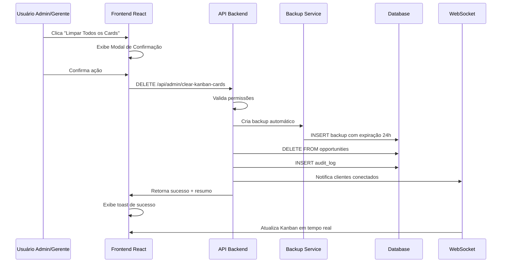

# Plano de Implementação: Botão "Limpar Todos os Cards"

## 1. Visão Geral da Implementação

Este documento detalha o plano de implementação técnica para a funcionalidade "Limpar Todos os Cards" no sistema CRM. A implementação será dividida em fases para garantir qualidade e minimizar riscos.

## 2. Fases de Implementação

### Fase 1: Backend - APIs e Serviços (Prioridade Alta)
**Duração estimada:** 2-3 horas

#### 2.1 Criação de Endpoints da API
- **Arquivo:** `server/routes.ts`
- **Novos endpoints:**
  - `GET /api/admin/kanban-cards-count` - Verificar quantidade de cards
  - `DELETE /api/admin/clear-kanban-cards` - Limpar todos os cards
  - `POST /api/backup/create-cards-backup` - Criar backup das oportunidades

#### 2.2 Serviço de Backup
- **Arquivo:** `server/backup-service.ts` (novo ou extensão)
- **Funcionalidades:**
  - Criar backup automático das oportunidades
  - Armazenar backup com expiração de 24h
  - Limpeza automática de backups expirados

#### 2.3 Extensão do Storage Service
- **Arquivo:** `server/postgres-storage.ts`
- **Novos métodos:**
  - `getOpportunitiesCount()` - Contar oportunidades
  - `createOpportunitiesBackup()` - Backup das oportunidades
  - `clearAllOpportunitiesOnly()` - Limpar apenas oportunidades

### Fase 2: Database - Estrutura e Funções (Prioridade Alta)
**Duração estimada:** 1-2 horas

#### 2.1 Migração de Database
- **Arquivo:** `migrations/0014_add_kanban_cleanup_features.sql`
- **Conteúdo:**
  - Tabela `backups` para armazenar backups temporários
  - Funções PostgreSQL para backup e limpeza
  - Triggers para limpeza automática de backups expirados
  - Configurações do sistema para a funcionalidade

#### 2.2 Índices e Performance
- Índices para tabela de backups
- Otimização de queries de contagem
- Triggers para auditoria

### Fase 3: Frontend - Componentes Base (Prioridade Média)
**Duração estimada:** 2-3 horas

#### 3.1 Modal de Confirmação
- **Arquivo:** `client/src/components/clear-cards-confirmation-modal.tsx`
- **Funcionalidades:**
  - Interface de confirmação com avisos
  - Checkbox de confirmação obrigatória
  - Validação de entrada do usuário
  - Estados de loading durante operação

#### 3.2 Hook de API
- **Arquivo:** `client/src/hooks/use-clear-cards.ts`
- **Funcionalidades:**
  - Hook personalizado para gerenciar estado
  - Integração com TanStack Query
  - Tratamento de erros
  - Invalidação de cache após limpeza

### Fase 4: Frontend - Integração na Tela de Configurações (Prioridade Média)
**Duração estimada:** 1-2 horas

#### 4.1 Extensão da Página de Configurações
- **Arquivo:** `client/src/pages/settings-page.tsx`
- **Modificações:**
  - Adicionar seção "Limpeza de Dados" na aba Sistema
  - Integrar botão com permissões adequadas
  - Tooltip explicativo
  - Estados de habilitado/desabilitado

#### 4.2 Componente do Botão
- **Arquivo:** `client/src/components/clear-cards-button.tsx`
- **Funcionalidades:**
  - Botão com estilo destrutivo (vermelho)
  - Ícone de lixeira
  - Tooltip informativo
  - Verificação de permissões

### Fase 5: Testes e Validação (Prioridade Alta)
**Duração estimada:** 2-3 horas

#### 5.1 Testes de Backend
- **Arquivo:** `tests/test-clear-cards-api.js`
- **Cenários:**
  - Teste de permissões (admin/gerente vs usuário comum)
  - Teste de backup automático
  - Teste de limpeza completa
  - Teste de contagem de cards

#### 5.2 Testes de Frontend
- **Arquivo:** `tests/test-clear-cards-ui.js`
- **Cenários:**
  - Renderização do botão conforme permissões
  - Funcionamento do modal de confirmação
  - Estados de loading e erro
  - Atualização em tempo real após limpeza

## 3. Arquivos a Serem Criados/Modificados

### Novos Arquivos
```
client/src/components/clear-cards-confirmation-modal.tsx
client/src/components/clear-cards-button.tsx
client/src/hooks/use-clear-cards.ts
migrations/0014_add_kanban_cleanup_features.sql
tests/test-clear-cards-api.js
tests/test-clear-cards-ui.js
```

### Arquivos Modificados
```
server/routes.ts (adicionar novos endpoints)
server/postgres-storage.ts (adicionar métodos de limpeza)
client/src/pages/settings-page.tsx (integrar botão na aba Sistema)
shared/schema.ts (tipos TypeScript se necessário)
```

## 4. Considerações de Segurança

### 4.1 Validação de Permissões
- Verificar role do usuário (admin/gerente) em múltiplas camadas
- Middleware de autorização no backend
- Verificação no frontend para UX

### 4.2 Auditoria e Logging
- Registrar todas as ações de limpeza no audit_logs
- Incluir informações do usuário e timestamp
- Manter histórico para compliance

### 4.3 Backup e Recuperação
- Backup automático obrigatório antes da limpeza
- Retenção de 24 horas para recuperação
- Limpeza automática de backups expirados

## 5. Fluxo de Dados



## 6. Critérios de Aceitação

### 6.1 Funcionalidades Obrigatórias
- ✅ Botão visível apenas para admin/gerente na aba Sistema
- ✅ Botão desabilitado quando não há cards
- ✅ Modal de confirmação com checkbox obrigatória
- ✅ Backup automático antes da limpeza
- ✅ Limpeza completa de todas as oportunidades
- ✅ Registro no log de auditoria
- ✅ Mensagem de sucesso após operação
- ✅ Atualização em tempo real do Kanban

### 6.2 Validações de Segurança
- ✅ Verificação de permissões no backend e frontend
- ✅ Backup criado com sucesso antes da limpeza
- ✅ Ação registrada no audit log
- ✅ Tratamento adequado de erros

### 6.3 Performance e UX
- ✅ Operação completa em menos de 5 segundos
- ✅ Feedback visual durante processamento
- ✅ Tooltip explicativo no botão
- ✅ Estados de loading adequados

## 7. Riscos e Mitigações

### 7.1 Riscos Identificados
- **Perda acidental de dados:** Mitigado com backup automático e modal de confirmação
- **Acesso não autorizado:** Mitigado com validação de permissões em múltiplas camadas
- **Falha no backup:** Mitigado com validação antes da limpeza
- **Performance:** Mitigado com operações otimizadas e feedback visual

### 7.2 Plano de Rollback
- Manter backup das oportunidades por 24h
- Função de restauração via SQL (manual)
- Logs detalhados para investigação
- Possibilidade de desabilitar funcionalidade via configuração

## 8. Cronograma de Entrega

| Fase | Duração | Dependências | Entregáveis |
|------|---------|--------------|-------------|
| Fase 1 - Backend APIs | 2-3h | - | Endpoints funcionais |
| Fase 2 - Database | 1-2h | Fase 1 | Migração aplicada |
| Fase 3 - Frontend Base | 2-3h | Fase 1, 2 | Componentes criados |
| Fase 4 - Integração UI | 1-2h | Fase 3 | Interface completa |
| Fase 5 - Testes | 2-3h | Todas anteriores | Testes passando |

**Total estimado:** 8-13 horas de desenvolvimento