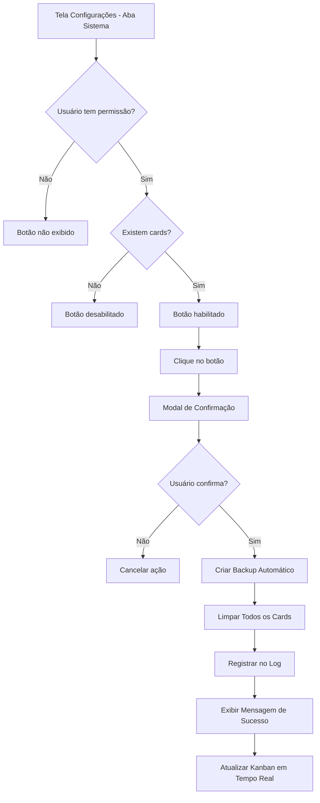

# Funcionalidade: Botão "Limpar Todos os Cards" - Requisitos do Produto

## 1. Visão Geral do Produto

Este documento especifica a implementação de uma funcionalidade crítica de administração que permite aos usuários autorizados limpar completamente todos os cards do quadro Kanban através da tela de configurações do sistema CRM. A funcionalidade visa fornecer uma ferramenta de manutenção segura e controlada para reset completo do pipeline de vendas.

O objetivo é oferecer aos administradores e gerentes uma forma rápida e segura de reinicializar o quadro Kanban, mantendo a integridade estrutural do sistema e garantindo rastreabilidade através de logs de auditoria.

## 2. Funcionalidades Principais

### 2.1 Papéis de Usuário

| Papel | Método de Acesso | Permissões Principais |
|-------|------------------|----------------------|
| Administrador | Login com credenciais admin | Acesso completo à funcionalidade, pode limpar todos os cards |
| Gerente | Login com credenciais de gerente | Acesso completo à funcionalidade, pode limpar todos os cards |
| Vendedor | Login com credenciais de vendedor | Sem acesso à funcionalidade |
| Usuário | Login com credenciais básicas | Sem acesso à funcionalidade |

### 2.2 Módulos de Funcionalidade

Nossa funcionalidade de limpeza de cards consiste nas seguintes páginas principais:

1. **Tela de Configurações**: interface principal onde o botão será integrado na aba "Sistema"
2. **Modal de Confirmação**: interface de confirmação com validações de segurança
3. **Sistema de Backup**: processo automático de backup antes da limpeza

### 2.3 Detalhes das Páginas

| Nome da Página | Nome do Módulo | Descrição da Funcionalidade |
|----------------|----------------|----------------------------|
| Configurações - Aba Sistema | Botão Limpar Cards | Exibir botão vermelho com ícone de lixeira/vassoura. Incluir tooltip "Remover permanentemente todos os cards deste quadro". Desabilitar quando não há cards. |
| Modal de Confirmação | Interface de Confirmação | Exibir modal com título "Confirmar Limpeza de Cards", texto explicativo dos riscos, checkbox de confirmação "Entendo que esta ação é irreversível", botões Cancelar e Confirmar. |
| Sistema de Backup | Backup Automático | Criar backup automático de todas as oportunidades antes da limpeza. Manter backup recuperável por 24 horas. |
| Log de Auditoria | Registro de Ações | Registrar ação no log com timestamp, usuário responsável, quantidade de cards removidos e status da operação. |

## 3. Processo Principal

**Fluxo do Administrador/Gerente:**
1. Usuário acessa Configurações → Aba Sistema
2. Visualiza botão "Limpar Todos os Cards" (habilitado apenas se existirem cards)
3. Clica no botão e visualiza tooltip explicativo
4. Sistema exibe modal de confirmação com avisos de segurança
5. Usuário confirma a ação marcando checkbox e clicando "Confirmar"
6. Sistema cria backup automático das oportunidades
7. Sistema remove todos os cards do Kanban
8. Sistema registra ação no log de auditoria
9. Sistema exibe mensagem de sucesso "Todos os cards foram removidos com sucesso"
10. Kanban é atualizado em tempo real mostrando colunas vazias

## 4. Design da Interface do Usuário

### 4.1 Estilo de Design

**Elementos principais do design:**
- **Cores primárias:** Vermelho (#dc2626) para o botão de ação destrutiva, cinza (#6b7280) para elementos secundários
- **Estilo do botão:** Botão sólido vermelho com bordas arredondadas, ícone de lixeira (Trash2) à esquerda
- **Fonte:** Sistema padrão do Tailwind CSS, tamanho base para texto do botão
- **Layout:** Card-based na seção de Configurações Avançadas, alinhamento à esquerda
- **Ícones:** Lucide React icons (Trash2 para lixeira, AlertTriangle para avisos)

### 4.2 Visão Geral do Design das Páginas

| Nome da Página | Nome do Módulo | Elementos da UI |
|----------------|----------------|-----------------|
| Configurações - Sistema | Seção Limpeza de Dados | Card com título "Limpeza de Dados", descrição explicativa, botão vermelho "Limpar Todos os Cards" com ícone Trash2, tooltip hover com texto explicativo |
| Modal de Confirmação | Interface de Confirmação | Modal overlay escuro, card central branco, ícone de alerta, título "Confirmar Limpeza", texto explicativo em vermelho, checkbox de confirmação, botões "Cancelar" (cinza) e "Confirmar" (vermelho) |
| Mensagem de Sucesso | Toast de Feedback | Toast verde no canto superior direito, ícone de check, texto "Todos os cards foram removidos com sucesso", auto-dismiss em 5 segundos |

### 4.3 Responsividade

A funcionalidade é desktop-first com adaptação para mobile. Em dispositivos móveis, o modal ocupa 90% da largura da tela com padding adequado. O botão mantém tamanho legível e o tooltip é adaptado para touch interaction.